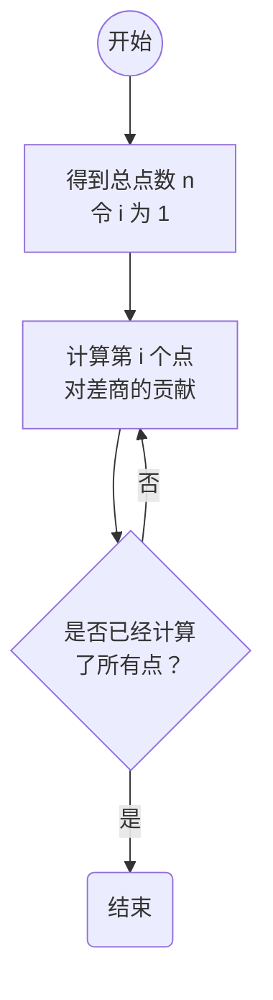
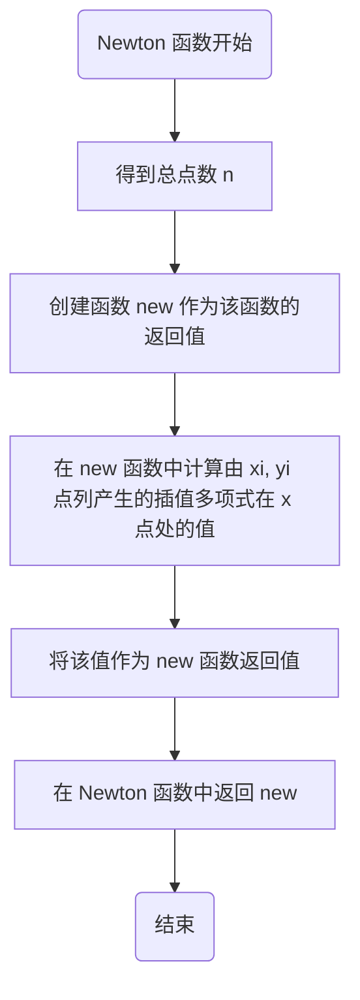
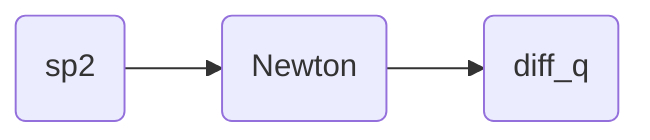

# 1 问题重述
1. 观察高次插值多项式的龙格现象、避免龙格现象
	(1) 给定函数 $f(x) = \dfrac 1{1+x^2},\ x\in [-10, 10]$，取等距节点，构造 Newton 插值多项式 $N_5(x), N_{10}(x), N_{15}(x)$ 
	(2) 使用分段二次插值 $N_{2, 20}$ 和三次样条插值函数 $S_{10}(x), S_{20}(x)$ 
	(3) 使用切比雪夫正交多项式零点作为插值节点，构造插值多项式，避免龙格现象
2. 用插值算法解决一个实际应用问题，这里我们选取问题“插值算法在图片放大与旋转中的应用”
# 2 构造 Newton 插值多项式观察龙格现象
## 2-1 算法基础知识
- **$k$ 阶差商**的递归定义式：设已知函数值 $f(x_{i}),\ i=0,1,\cdots,n,\cdots$，且 $x_{i}$ 彼此互异，则称 $f[x_i, x_{i+1}, \cdots, x_{i+k}] = \dfrac{f[x_{i+1}, \cdots, x_{i+k}] - f[x_i, \cdots, x_{i+k-1}]}{x_{i+k} - x_i}$ 为 $f(x)$ 关于点 $x_i, x_{i+1}, \cdots, x_{i+k}$ 的 $k$ 阶**差商**，其中 $f[x_j] = f(x_j)$ 称为 $f(x)$ 关于 $x_j$ 的**零阶差商** 
- **重节点差商**：关于两个节点相重，其**重节点差商**定义式为 $f\left[x_{0}, x_{0}\right]=\lim\limits_{x_{1} \rightarrow x_{0}} f\left[x_{1}, x_{0}\right]=\lim\limits_{x_{1} \rightarrow x_{0}} \dfrac{f\left(x_{1}\right)-f\left(x_{0}\right)}{x_{1}-x_{0}}=f^{\prime}\left(x_{0}\right)$，一般情况，**重节点差商**定义式为 $f[x_{0}, x_{1}, \cdots, x_{n}, x, x]=\dfrac{\mathrm{d}}{\mathrm{d}x} f[x_{0}, x_{1}, \cdots, x_{n}, x]$ 
- **差商的性质**：$f\left[x_{0}, x_{1}, \cdots, x_{k}\right]= \sum\limits_{i=0}^{k} \dfrac{f\left(x_{i}\right)}{\omega_{k}^{\prime}\left(x_{i}\right)}$，其中 $\omega^{\prime}_{n}(x_{i}) = \prod\limits_{\substack{j=0 \\ j\neq i}}^{n}(x_{i}-x_{j})$ 
- **牛顿 (Newton) 插值公式**：设 $x_{0},x_{1},\cdots,x_{n}$ 为任意 $n+1$ 个不同的节点，则关于节点 $x_0, x_1, \cdots, x_n$ 有插值多项式 $N_{n}(x)= f(x_{0})+f[x_{0},x_{1}](x-x_{0})+\cdots+f[x_{0},x_{1},\cdots,x_{n}](x-x_{0})(x-x_{1})\cdots(x-x_{n-1})$ 
	- *证明过程* 
		**第 1 步**：几种低次的 Newton 插值公式的建立过程
		*零次插值多项式情形* 
		显然关于节点 $x_{0}$ 的零次插值多项式 $p_{0}(x)=f(x_{0})$，下面分别考察一次和二次插值多项式情形
		*一次插值多项式情形* 
		关于节点 $x_{0},x_{1}$ 的一次插值多项式 $p_{1}(x)$，根据承袭性的要求，可将其待定为 $p_{1}(x)=p_{0}(x)+q(x)$ 
		由 $p_{1}(x)$ 的定义知 $q\in P_{1}$，且满足 $q(x_{0})=0$，故可令 $q(x)=c_{1}(x-x_{0})$ 
		利用 $p_{1}(x_{1})=f(x_{1})$，可求得 $c_{1}=\dfrac{f(x_{1})-f(x_{0})}{x_{1}-x_{0}}$，即 $c_{1}=f[x_{0},x_{1}]$ 
		*二次插值多项式情形* 
		关于节点 $x_{0}, x_{1}, x_{2}$ 的二次插值多项式 $p_{2}(x)$，将其待定为 $p_{2}(x)=p_{1}(x)+q(x)$ 
		其中 $q\in P_{2}$，且满足 $q(x_{0})=q(x_{1})=0$，故可令 $q(x)=c_{2}(x-x_{0})(x-x_{1})$ 
		利用 $p_{2}(x_{2})=f(x_{2})$，以及 $p_{1}(x_{2})=f(x_{0})+c_{1}(x_{2}-x_{0})$，可求得 $c_{2}=\dfrac{f(x_{2})-p_{1}(x_{2})}{(x_{2}-x_{0})(x_{2}-x_{1})}=\dfrac{\dfrac{f(x_{2})-f(x_{1})}{x_{2}-x_{1}}-\dfrac{f(x_{1})-f(x_{0})}{x_{1}-x_{0}}}{x_{2}-x_{0}}$，即 $c_{2}=f[x_{0},x_{1},x_{2}]$ 
		**第 2 步**：$i$ 次插值多项式的 Newton 插值公式的建立过程
		按照上述规律，$f(x)$ 关于节点 $x_0, x_1, \cdots, x_i$ 的 $i$ 次插值多项式 $p_{i}(x)$ 可以待定成：
		$p_{i}(x)=p_{i-1}(x)+c_{i}(x-x_{0})(x-x_{1})\cdots(x-x_{i-1}),\ i=1,2,\cdots,n$，利用归纳法可知 $c_{j}=f[x_{0},\cdots,x_{j}]$ 
		**第 2 步的补充**：$c_j = f[x_0,\cdots, x_j]$ 的详细证明
		$j=1,2$ 时，由第 1 步显然得证
		现在假设 $c_{j}=f[x_{0},\cdots,x_{j}]$ 对一切 $j\leqslant i-1$ 都成立，下面证明当 $j=i$ 时，$c_{j}=f[x_{0},\cdots,x_{j}]$ 也成立。
		利用 $p_{i}(x)=p_{i-1}(x)+c_{i}(x-x_{0})(x-x_{1})\cdots(x-x_{i-1}),\ i=1,2,\cdots,n$，并注意 $p_i(x_i) = f(x_i)$ 
		则 $c_{j}=f[x_{0},\cdots,x_{j}]$（这里 $j=i$）等价于 $f(x_i) = p_{i-1}(x_i) + f[x_0, \cdots, x_i](x_i - x_0)(x_i - x_1) \cdots(x_i - x_{i-1})$ 
		由假设可知 $p_{i-1}(x) = f(x_0) + f[x_0, x_1](x - x_0) + \cdots + f[x_0, x_1, \cdots, x_{i-1}] (x - x_0)(x - x_1) \cdots (x - x_{i-2})$ 
		故上式等价于：
		$$
		\begin{aligned}
		f(x_i) =& f(x_0) + f[x_0, x_1](x_i - x_0) + \cdots + f[x_0, x_1, \cdots, x_{i-1}] (x_i - x_0)(x_i - x_1) \cdots(x_i - x_{i-2})\\ &+ f[x_0, x_1, \cdots, x_i](x_i - x_0)(x_i - x_1) \cdots(x_i - x_{i-2})(x_i - x_{i-1}) \quad (*)
		\end{aligned}
		$$
		故只需证明 $(*)$ 式
		由差商的定义，有
		$\begin{cases}f(x_{i})=f(x_{0})+(x_{i}-x_{0})f[x_{i},x_{0}],\\f[x_{i},x_{0}]=f[x_{0},x_{1}]+(x_{i}-x_{1})f[x_{i},x_{0},x_{1}],\\f[x_{i},x_{0},x_{1}]=f[x_{0},x_{1},x_{2}]+(x_{i}-x_{2})f[x_{i},x_{0},x_{1},x_{2}],\\\cdots\cdots\\f[x_{i},x_{0},\cdots,x_{i-2}]=f[x_{0},x_{1},\cdots,x_{i-1}]+(x_{i}-x_{i-1})f[x_{i},x_{0},\cdots,x_{i-1}]\end{cases}$ 
		依次将后一式代入前一式，便可证得 $(*)$ 式，即当 $j=i$ 时，$c_j = f[x_0,\cdots, x_j]$ 成立，证毕！
		**第 3 步**：证明原命题
		利用 $c_{i}$ 的计算公式，$f(x)$ 关于节点 $x_{0},x_{1},\cdots,x_{n}$ 的 $n$ 次插值多项式可以写成
		$N_{n}(x)= f(x_{0})+f[x_{0},x_{1}](x-x_{0})+\cdots+f[x_{0},x_{1},\cdots,x_{n}](x-x_{0})(x-x_{1})\cdots(x-x_{n-1})$ 
		综上证毕！
## 2-2 算法实现逻辑
- 函数 `diff_q(xi, yi)`：负责求点列 `(xi, yi)` 的差商
	- *若使用差商的递归定义式*：需要使用函数递归，时间空间效率可能都会变低，故不考虑这种方式。
	- *若使用差商的性质*：由于 $f\left[x_{0}, x_{1}, \cdots, x_{k}\right]= \sum\limits_{i=0}^{k} \dfrac{f\left(x_{i}\right)}{\omega_{k}^{\prime}\left(x_{i}\right)}$，我们可以用内外两层循环：外层循环实现求和；内层循环重点来计算每一项的 $\omega_k'(x_i)$，进而得到每一项的 $\dfrac{f(x_i)}{\omega_k'(x_i)}$。通过这种方式我们可以在 $O(k^2)$ 复杂度内求出 $f[x_0, x_1, \cdots, x_k]$，且常数较小。
- 函数 `Newton(xi, yi)`：负责求点列 `(xi, yi)` 插值得到的 Newton 插值公式
	- 由于每一个 Newton 插值公式都是用若干点列得到的，所以 Newton 插值公式依赖具体的插值节点。
	- 于是我们可以编写一个返回值为函数的函数 `Newton(xi, yi)`，它的返回值为用点列 $(x_i, y_i),\ i=0,1,2,\cdots,n$ 得到的 Newton 插值多项式函数 `new(x)` 
	- 紧接着我们就可以用 `new(x)` 来计算点 $x$ 处该 Newton 插值多项式的值了
## 2-3 相关函数的流程图、源代码
### 2-3-1 `diff_q(xi, yi)` 
求差商的流程图如下图：

求差商的源代码在文件 `function.py` 中，内容如下：
```python
def diff_q(xi, yi):
  '''
  输入节点坐标数组 xi 和对应函数值数组 yi, 返回它们的差商 res
  :param xi: list-like 第 i 个节点的横坐标
  :param yi: list-like 第 i 个节点的函数值
  :return: float 差商
  '''
  
  res = 0
  n = len(xi)
  for i in range(n):
    omega = 1
    for j in range(n):
      if (i == j):
        continue
      omega *= xi[i] - xi[j]
    res += yi[i] / omega
  return res
```
### 2-3-2 `Newton(xi, yi)` 
求 Newton 插值多项式的流程图如下图：


求 Newton 插值多项式函数的源代码在文件 `function.py` 中，内容如下：
```python
def Newton(xi, yi):
  '''
  给出节点序列 (xi, yi), 返回这些节点的 Newton 插值多项式函数
  :param xi: list-like 第 i 个节点的横坐标
  :param yi: list-like 第 i 个节点的函数值
  :return: function, Newton 插值多项式函数
  '''
  n = len(xi)
  def new(x):
    '''
    返回 x 点处 Newton 插值多项式函数值
    :param x: float, 自变量
    :return: float, x 点处的 Newton 插值多项式函数值
    '''
    res = 0
    for i in range(n):
      w = 1
      for j in range(i):
        w *= x - xi[j]
      res += w * diff_q(xi[:i+1], yi[:i+1])
    return res
  return new
```
## 2-4 可视化
# 3 使用分段二次插值观察龙格现象
## 3-1 算法基础知识
- **分划**（**网格剖分**）、**剖分节点**、**内剖分节点**、**剖分单元 $e_j$**、$h_j$：引入区间 $[a,b]$ 的一个**分划**（**网格剖分**）$\Delta: a=x_0 < x_1 < \cdots < x_{n-1} < x_n = b$，称 $x_0, x_1, \cdots, x_{n-1}, x_n$ 为**剖分节点**，$x_1, \cdots, x_{n-1}$ 为**内剖分节点**，小区间 $e_j = [x_{j-1}, x_j]$ 为第 $j$ 个**剖分单元**，并记 $h_j = x_j - x_{j-1}$ 
- $f_i, f_i', f_i''$：记 $f_i = f(x_i)$，$f_i' = f'(x_i)$ 和 $f_i'' = f''(x_i)$，它们分别表示被插函数 $f(x)$ 在节点 $x_i$ 处的函数值、一阶和二阶导数值。
- **多项式样条空间 $Sp(k;l;\Delta)$**：设关于剖分 $\Delta$ 的分段多项式插值函数空间为 $Sp(k;l;\Delta)=\{s\in C^l[a,b]:s\in P_k,x\in e_i,i=1,2,\cdots,n\}$，它表示在每个剖分单元为 $k$ 次多项式且在整个定义区间 $[a,b]$ 上 $l$ 阶连续可微的函数的全体。称 $Sp(k;l;\Delta)$ 为**关于剖分 $\Delta$ 重数为 $k-l$ 的 $k$ 次多项式样条空间** 
- 多项式样条空间 $Sp(k;M;\Delta)$ 的**维数公式**：
	- 若不考虑段与段之间的连接条件，则关于分划 $\Delta$ 的分段 $k$ 次多项式函数空间的维数为 $m_{1}=(k+1)n$ 
	- 由于 $Sp(k;M;\Delta)$ 中的函数在每个内剖分节点处要求满足 $k-m_{i}$ 阶连续可微，所以共有 $\displaystyle\sum_{i=1}^{n-1}(k-m_{i}+1)$ 个约束条件，则样条空间 $Sp(k;M;\Delta)$ 的维数公式为 $(k+1)n-\displaystyle\sum_{i=1}^{n-1}(k-m_{i}+1)$ 
## 3-2 算法实现逻辑
- 考虑分段二次插值，在每个区间上需要 3 个已知数据点，故考虑 $x_0, x_2, x_4, \cdots, x_n$ 将区间分为 $n/2$ 个小区间，对于 $x\in [x_i, x_{i+2}]$，取 $x_i, x_{i+1}, x_{i+2}$ 三个点作为 Newton 插值节点
- 函数 `sp2(xi, yi, x)`：来实现该功能
## 3-3 相关函数的流程图、源代码
### 3-3-1 `sp2(xi, yi, x)` 
求分段二次插值的函数调用图为：

求分段二次插值的函数的源代码在文件 `function.py` 中，内容如下：
```python
def sp2(xi, yi, x):
  '''
  返回由点列 (xi, yi) 产生的分段二次插值函数在 x 点处的取值
  :param xi: list-like, 插值节点横坐标
  :param yi: list-like, 插值节点函数值
  :param x: float, 自变量
  :return: float, 分段二次插值函数值
  '''
  for pos in range(0, len(xi), 2):
    if (x < xi[pos]):
      break
  # pos 为第一个比 x 大的划分点，那么 pos-2, pos-1, pos 则为目标区间
  x_ei = np.array((xi[pos - 2], xi[pos - 1], xi[pos]))
  y_ei = np.array((yi[pos - 2], yi[pos - 1], yi[pos]))
  return Newton(x_ei, y_ei)(x)
```
## 3-4 可视化
# 4 使用三次样条插值函数观察龙格现象
## 4-1 算法基础知识
- **三次插值样条函数**：可以定义相应的**三次插值样条函数** $s\in Sp(3; \Delta)$，首先自然要求 $s(x)$ 在所有内节点上满足 $s(x_i) = f_i,\ i=1,2,\cdots, n-1$，为了将 $s(x)$ 唯一确定，还需提供另外 $4$ 个插值条件，通常有三种提法
	- **I 型边界条件**：$s(x_0) = f_0,\ s(x_n) = f_n;\quad s'(x_0) = f_0',\ s'(x_n) = f_n'$ 
	- **II 型边界条件**：$s(x_0) = f_0,\ s(x_n) = f_n;\quad s''(x_0) = f_0'',\ s''(x_n) = f_n''$ 
	- **III 型边界条件**（**周期型边界条件**）：$s(x_0) = f_0,\ s(x_0) = s(x_n);\quad s'(x_0) = s'(x_n);\quad s''(x_0) = s''(x_n)$ 
- **I 型三次插值样条函数**：可以定义如下所谓的 I 型三次样条插值问题：求 $s_{\text{I}} \in Sp(3; \Delta)$，满足插值条件 $s(x_i) = f_i,\ i=1,2,\cdots, n-1$ 和 I 型边界条件，称 $s_{\text{I}}(x)$ 为 **I 型三次插值样条函数** 
- **适定性**：I 型三次样条插值问题的解存在且唯一
	- *证明过程* 
		**第 1 步**：构造 $M_i$，并用 $M_i$ 表示 $s_{\text{I}}$，进而转化问题
		记 $M_{i}=s_{\text{I}}^{\prime\prime}(x_{i}),\ i=0,1,\cdots,n$，将其设为待定参数。
		由于 $s_{\text{I}}(x)$ 在 $e_{i}$ 上为三次多项式，故 $s_{\text{I}}^{\prime\prime}(x)$ 在 $e_{i}$ 上为线性函数，于是可得 $s_{\text{I}}^{\prime\prime}(x)$ 的分段表达式 $s_{\text{I}}^{\prime\prime}(x)=M_{i-1}\dfrac{x_{i}-x}{h_{i}}+M_{i}\dfrac{x-x_{i-1}}{h_{i}},\ x\in e_{i},\ i=1,2,\cdots, n$ 
		将上式积分两次，并利用 $s_{\text{I}}(x_{i-1})=f_{i-1}$，$s_{\text{I}}(x_{i})=f_{i}$ 来确定积分常数，可得
		$\begin{aligned} s_{\text{I}}(x)=&\dfrac{1}{6h_{i}}[(x_{i}-x)^{3}M_{i-1}+(x-x_{i-1})^{3}M_{i}] + \dfrac{1}{h_{i}} [(x_{i}-x)f_{i-1} + (x-x_{i-1})f_{i}] \\ &- \dfrac{h_{i}}{6}[(x_{i}-x)M_{i-1}+(x-x_{i-1})M_{i}],\quad x\in e_{i},\ i=1, 2, \cdots,  n \end{aligned}$ 
		由上式可知，要证 $s_{\text{I}}(x)$ 唯一存在，只需证明 $M_{i}\ (i=0,1,\cdots,n)$ 可被唯一确定。
		**第 2 步**：求 $s_I'(x_j-0)$ 和 $s_{\text{I}}(x_{j-1} + 0)$ 
		对 $s_{\text{I}}(x)$ 求导，有 $s_{\text{I}}^{\prime}(x)=-M_{i-1}\dfrac{(x_{i}-x)^{2}}{2h_{i}}+M_{i}\dfrac{(x-x_{i-1})^{2}}{2h_{i}}+\dfrac{f_{i}-f_{i-1}}{h_{i}}-\dfrac{(M_{i}-M_{i-1})h_{i}}{6}$，其中 $x\in e_{i},\ i=1,2,\cdots,n$ 
		于是，单元 $e_{j}$ 右端点的左极限和左端点的右极限分别为
		$\begin{cases}s_{\text{I}}^{\prime}(x_{j}-0)=\dfrac{h_{j}}{6}M_{j-1}+\dfrac{h_{j}}{3}M_{j}+\dfrac{f_{j}-f_{j-1}}{h_{j}},\\s_{\text{I}}^{\prime}(x_{j-1}+0)=-\dfrac{h_{j}}{3}M_{j-1}-\dfrac{h_{j}}{6}M_{j}+\dfrac{f_{j}-f_{j-1}}{h_{j}},\end{cases}\quad j=1,2,\cdots,n \quad (*)$ 
		**第 3 步**：得到 $M_j$ 的递推式的主要部分
		显然，上述 $s_{\text{I}}(x)$ 满足其自身和二阶导函数在整个区间 $[a,b]$ 上连续，由连接条件，可知其一阶导函数在整个区间 $[a,b]$ 上连续，即 $s_{\text{I}}^{\prime}(x_{j}+0)=s_{\text{I}}^{\prime}(x_{j}-0),\quad j=1,2,\cdots,n-1$ 
		将其与 $(*)$ 联立可得 $\dfrac{h_{j}}{6}M_{j-1}+\dfrac{h_{j}+h_{j+1}}{3}M_{j}+\dfrac{h_{j+1}}{6}M_{j+1}=\dfrac{f_{j+1}-f_{j}}{h_{j+1}}-\dfrac{f_{j}-f_{j-1}}{h_{j}},\ j=1,2,\cdots,n-1$ 
		若记 $\lambda_{j}=\dfrac{h_{j+1}}{h_{j}+h_{j+1}},\ \mu_{j}=1-\lambda_{j}=\dfrac{h_{j}}{h_{j}+h_{j+1}},\ j=1,2,\cdots,n-1$，则上式可化为 $\mu_{j}M_{j-1}+2M_{j}+\lambda_{j}M_{j+1}=d_{j},\ j=1,2,\cdots, n-1$，这里 $d_{j}=6f[x_{j-1},x_{j},x_{j+1}]$，其中$f[x_{j-1},x_{j},x_{j+1}]$ 表示 $f(x)$ 的二阶差商
		**第 4 步**：得到 $M_j$ 的递推式的边界条件
		此外，$s_{\text{I}}^{\prime}(x)$ 在端点 $x_{0}$ 和 $x_{n}$ 处应分别右连续和左连续，利用附加边界条件 $s_{\text{I}}^{\prime}(x_{0})=f_{0}^{\prime}$，$s_{\text{I}}^{\prime}(x_{n})=f_{n}^{\prime}$ 及 $(*)$ 式，可得 $\begin{cases}-\dfrac{h_{1}}{3}M_{0}-\dfrac{h_{1}}{6}M_{1}+\dfrac{f_{1}-f_{0}}{h_{1}}=f_{0}^{\prime} \\ \dfrac{h_{n}}{6}M_{n-1}+\dfrac{h_{n}}{3}M_{n}+\dfrac{f_{n}-f_{n-1}}{h_{n}}=f_{n}^{\prime} \end{cases}$ 
		化简之, 有 $\left\{\begin{array}{l} 2M_{0}+M_{1}=\dfrac{6}{h_{1}} \left( \dfrac{f_{1}-f_{0}}{h_{1}} - f_{0}^{\prime} \right):=d_{0} \\ M_{n-1}+2M_{n} = \dfrac{6}{h_{n}}\left(f_{n}^{\prime}-\dfrac{f_{n}-f_{n-1}}{h_{n}}\right):=d_{n} \end{array}\right.$ 
		**第 5 步**：联立第 3 步结果和第 4 步结果，可以得到一个关于待定参数 $M_{0}, M_{1},\cdots, M_{n}$ 的 $n+1$ 阶线性代数方程组，其矩阵形式为
		$$
		\left[\begin{array}{cccc}
		2 & 1 & & \\
		\mu_{1} & 2 & \lambda_{1} & \\
		 & \mu_{2} & 2 & \lambda_{2} \\
		 & & \ddots & \ddots & \ddots \\
		 & & & \mu_{n-1} & 2 & \lambda_{n-1} \\
		 & & & & 1 & 2
		\end{array}\right]
		\left[\begin{array}{c}
		M_{0} \\ M_{1} \\ M_{2} \\ \vdots \\ M_{n-1} \\ M_{n}
		\end{array}\right]=
		\left[\begin{array}{c}
		d_{0} \\ d_{1} \\ d_{2} \\ \vdots \\ d_{n-1} \\ d_{n}
		\end{array}\right]
		$$
		上述方程称为**三弯矩方程** 
		显然上述方程组的稀疏矩阵是严格对角占优的，因此非奇异，于是由上面方程组可以唯一解出 $M_i\ (i=0,1,\cdots,n)$，从而证得 I 型三次样条插值问题的解存在且唯一
		综上证毕！
	- 上述过程是通过建立三弯矩方程证明的，类似还可以通过建立三转角方程证明该命题，这时只需将 $m_i = s_{\text{I}}' (x_i),\ i=0,1,\cdots,n$ 这组待定参数来置换上述参数 $M_i$ 
	- II 型、III 型类似可证
## 4-2 算法实现逻辑
- 函数 `diff_vector(xi, yi, dy)`：负责通过 $d_{j}=6f[x_{j-1},x_{j},x_{j+1}]$ 和 $\left\{\begin{array}{l} 2M_{0}+M_{1}=\dfrac{6}{h_{1}} \left( \dfrac{f_{1}-f_{0}}{h_{1}} - f_{0}^{\prime} \right):=d_{0} \\ M_{n-1}+2M_{n} = \dfrac{6}{h_{n}}\left(f_{n}^{\prime}-\dfrac{f_{n}-f_{n-1}}{h_{n}}\right):=d_{n} \end{array}\right.$ 计算三弯矩方程右端常数项 $d$ 
- 函数 `init_M(hi, d)` 
	负责通过 $\lambda_{j}=\dfrac{h_{j+1}}{h_{j}+h_{j+1}},\ \mu_{j}=1-\lambda_{j}=\dfrac{h_{j}}{h_{j}+h_{j+1}},\ j=1,2,\cdots,n-1$ 和
	$$
	\left[\begin{array}{cccc}
	2 & 1 & & \\
	\mu_{1} & 2 & \lambda_{1} & \\
	 & \mu_{2} & 2 & \lambda_{2} \\
	 & & \ddots & \ddots & \ddots \\
	 & & & \mu_{n-1} & 2 & \lambda_{n-1} \\
	 & & & & 1 & 2
	\end{array}\right]
	\left[\begin{array}{c}
	M_{0} \\ M_{1} \\ M_{2} \\ \vdots \\ M_{n-1} \\ M_{n}
	\end{array}\right]=
	\left[\begin{array}{c}
	d_{0} \\ d_{1} \\ d_{2} \\ \vdots \\ d_{n-1} \\ d_{n}
	\end{array}\right]
	$$
	求解三弯矩方程的解
- 函数 `cubic_spline(xi, yi, dy, x)`：计算三次样条插值函数在点 $x$ 处的值
## 4-3 相关函数的流程图、源代码
### 4-3-1 `diff_vector(xi, yi, dy)` 
该函数的流程图如下：


该函数的源代码在文件 `function.py` 中，内容如下：
```python
def diff_vector(xi, yi, dy):
  '''
  返回点列 (xi, yi) 以及外端点导数值 dy 构成的 I 型边界条件，对应的三弯矩方程右端常数项
  :param xi: list-like, 插值节点横坐标
  :param yi: list-like, 插值节点函数值
  :param dy: list-like, 该 list-like 长度为 2, 用来存储 x0 和 xn 处的导数值 (I 型边界条件)
  :return: lisk-like, 三弯矩方程右端常数项
  '''
  n = len(xi) - 1
  d = [6 * diff_q(xi[i-1:i+2], yi[i-1:i+2]) for i in range(1, n-1)]
  d.insert(0, ((yi[1] - yi[0]) / (xi[1] - xi[0]) - dy[0]) * 6 / (xi[1] - xi[0]))
  d.append((dy[-1] - (yi[n] - yi[n - 1]) / (xi[n] - xi[n - 1])) * 6 / (xi[n] - xi[n - 1]))
  return np.array(d)
```
### 4-3-2 `init_M(hi, d)` 
该函数的流程图如下：


该函数的源代码在文件 `function.py` 中，内容如下：
### 4-3-3 `cubic_spline(xi, yi, dy, x)` 
该函数的流程图如下：

该函数的源代码在文件 `function.py` 中，内容如下：
## 4-4 可视化
# 5 使用切比雪夫正交多项式零点作为插值节点来避免龙格现象
## 5-1 算法基础知识
## 5-2 算法实现逻辑
## 5-3 相关函数的流程图、源代码
## 5-4 可视化
