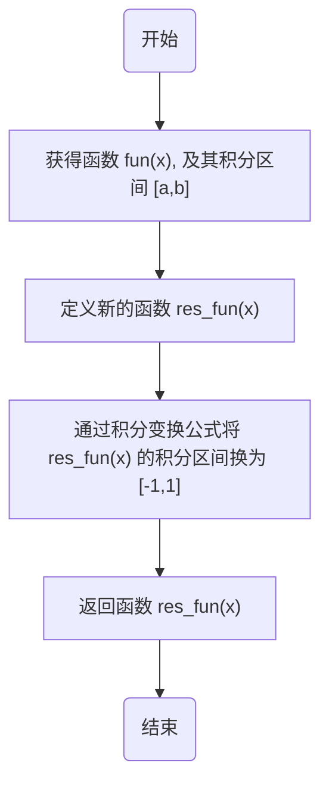
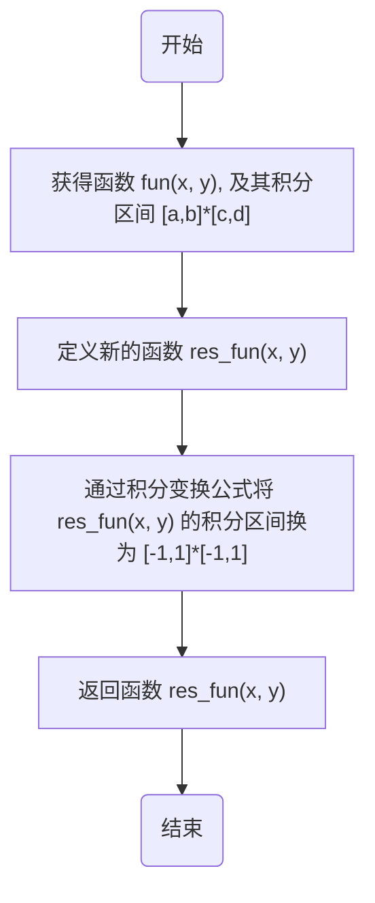

# 1 问题重述
1. 编写 Gauss-Legendre 积分算法求解一重积分问题
2. 编写 Gauss-Legendre 积分算法求解二重积分问题
3. 编写 Gauss-Legendre 积分算法求解三重积分问题
4. 举例计算，如该方法在有限元分析、计算几何或物理场模拟等领域的应用案例
# 2 Gauss-Legendre 求解一重积分问题
## 2-1 算法基础知识
- **带权正交基**、**带权正交多项式**：定义在 $[a, b]$ 上的函数系 $\{ g_{l}(x)\}_{l=0}^{n}$ 称为 $P_{n}$ 的**带权 $\rho(x)$ 正交基**（$g_{l}(x)$ 称为 $[a, b]$ 上的**带权 $l$ 次正交多项式**），如果它满足：
	(1) $g_{l}(x)=\sum\limits_{k=0}^{l}\alpha_{k}x^{k}$ 恰为 $l$ 次多项式，即 $\alpha_{l}\neq0$ 
	(2) $(g_{i},g_{j}) = \begin{cases}  0, & i\neq j \\ \displaystyle\int_{a}^{b}\rho(x)g_{i}^{2}(x)dx > 0, & i=j \end{cases}$ 
	- **正规正交基**：特别地，若 $(g_{i},g_{i}) = 1$，$i = 0,1,\cdots,n$，则称 $\{ g_{l}(x)\}_{l=0}^{n}$ 为 $[a, b]$ 上 $P_{n}$ 的**正规正交基** 
- **Legendre (勒让德) 多项式**：设 $\rho(x)\equiv 1$，$\{ l_{i}(x)\}_{0}^{n}$ 为 $[-1,1]$ 上 $P_{n}$ 的正规正交基，则称 $l_{i}(x)$ 为 **Legendre 多项式** 
	- *计算公式*：利用正交多项式的定义，可直接构造 Legendre 多项式，具体表达式为 $l_{k}(x)=\dfrac{1}{2^{k}k!}\cdot\sqrt{\dfrac{2k+1}{2}}\cdot\dfrac{\mathrm{d}^{k}}{\mathrm{~d} x^{k}}\left[\left(x^{2}-1\right)^{k}\right],\ k=0,1,\cdots,n$ 
	- *递推公式*：实用中，由于求高阶导数较麻烦，所以常按以下递推公式计算：$l_{k+1}(x)=\dfrac{\sqrt{(2k+1)(2k+3)}}{k+1}xl_{k}(x)-\dfrac{k}{k+1}\sqrt{\dfrac{2k+3}{2k-1}}l_{k-1}(x),\ k = 1, 2,\cdots$ 
- **$n$ 点 Gauss (高斯) 型求积公式**、**Gauss 点**：若形如 $\displaystyle \int_{a}^{b} \rho(x) f(x) \mathrm{d} x \approx \sum_{k=1}^{n} A_{k} f\left(x_{k}\right)$ 的求积公式具有 $2n-1$ 次代数精度，则称它为 **$n$ 点 Gauss (高斯) 型求积公式**，积分节点 $\{x_{k}\}$ 称为 **Gauss 点**  
- **定理**：对任何正整数 $n$，$n$ 点 Gauss 求积公式是存在的，其 Gauss 点就是求积区间上关于权函数的正交多项式系 $\left\{\varphi_{m}(x)\right\}$ 中 $\varphi_{n}(x)$ 的零点
- **Gauss-Legendre 求积公式**：Legendre 多项式 $L_{n}(x) = \dfrac{1}{2^{n} \cdot n!} \ \dfrac{\mathrm{d}^{n}}{\mathrm{d}x^{n}}\left[ \left( x^{2} - 1 \right)^{n} \right], \ n \geqslant 1, \ L_{0}(x) = 1$ 是 $[-1, 1]$ 上关于权函数 $\rho(x) \equiv 1$ 的正交多项式，于是 **$n$ 点 Gauss-Legendre 求积公式**为 $\displaystyle\int_{-1}^{1} f(x) \mathrm{d}x \approx \sum\limits_{k=1}^{n} A_{k} f\left( x_{k} \right)$，其中 $x_{1}, x_{2}, \cdots, x_{n}$ 是 $L_{n}(x)$ 的 $n$ 个互异零点，$A_{k} = \displaystyle\int_{-1}^{1} l_{k}(x) \mathrm{d}x, \ l_{k}(x) = \prod\limits_{\substack{i=1 \\ i \neq k}}^{n} \dfrac{x - x_{i}}{x_{k} - x_{i}}, \ k = 1, 2, \cdots, n$ 
	- $n$ 点 Gauss-Legendre 求积公式的*误差*为：$E_n[f] = \dfrac{2^{2n+1}(n!)^4}{(2n+1)[(2n)!]^3} f^{(2n)}(\xi),\ -1<\xi<1$ 
- **积分变换**：设原积分区间为 $[a,b]$，定义变换：$x = \dfrac{b-a}2 t + \dfrac{a+b}2$，则 $\displaystyle \int_a^b f(x)\mathrm dx = \int_{-1}^1 f\left( \dfrac{b-a}2 t + \dfrac{a + b}2 \right) \cdot \dfrac{b-a}2 \mathrm dt$ 
## 2-2 算法实现逻辑
- 函数 `single_integral_transform(fun, a, b)`：负责将函数 $fun(x)$ 在 $[a,b]$ 上的积分问题转换为 $[-1,1]$ 上对函数 $fun'(x)$ 的积分问题，$fun'(x)$ 为该函数返回值
	- 利用公式 $\displaystyle \int_a^b f(x)\mathrm dx = \int_{-1}^1 f\left( \dfrac{b-a}2 t + \dfrac{a + b}2 \right) \cdot \dfrac{b-a}2 \mathrm dt$ 即可求得
- 函数 `get_single_integration(fun, a, b, n)`：负责求函数 $fun(x)$ 在 $[a,b]$ 上的积分 (具有 $2n-1$ 次代数精度)
	- 利用 `np.polynomial.legendre.leggauss(n)` 求出对应的高斯点和高斯系数
	- 再将函数定义域换为 $[-1,1]$ 
	- 最后用 $\displaystyle\int_{-1}^{1} f(x) \mathrm{d}x \approx \sum\limits_{k=1}^{n} A_{k} f\left( x_{k} \right)$ 即可求得
## 2-3 相关函数的流程图、源代码
### 2-3-1 `single_integral_transform(fun, a, b)` 
流程图如下：

源代码如下：
### 2-3-2 `get_single_integration(fun, a, b, n)` 
流程图如下：
源代码如下：
## 2-4 举例计算
1. 分别用 2 至 15 个 Gauss 点求 $\displaystyle \int_0^1 x^3 \mathrm dx$，如图 1
	- 可以看到，计算效果很好
2. 分别用 2 至 15 个 Gauss 点求 $\displaystyle \int_0^{\pi/2} \dfrac{\sin^2 x}{\sin x + \cos x} \mathrm dx$，如图 2
	- 可以看到，计算效果很好
3. 分别用 2 至 50 个 Gauss 点求 $\displaystyle \int_{-1}^1 e^{\cos(20x)} \mathrm dx$，如图 3
	- 注意：该被积函数 $f(x) = e^{\cos(20x)}$ 是快速振荡的，因为余弦函数的频率高，周期短。用高斯—勒让德积分时，如果高斯点数目不足，就可能无法在每个周期内采集足够的点，导致数值积分结果误差很大
	- 可以看到当 Gauss 点超过 40 个时才逐渐趋于平稳
4. 分别用 2 至 15 个 Gauss 点求 $\displaystyle \int_{-1}^1 f(x)\mathrm dx$，其中 $f(x) = \begin{cases} e^{-1/x^2} & x\not=0 \\ 0 & x=0 \end{cases}$，如图 4
	- 可以看到，在数量稍微多一点的 Gauss 点的情况下，计算效果很好
![[single_integral 2.jpg]]
# 3 Gauss-Legendre 求解二重积分问题
## 3-1 算法基础知识
**二重积分**：该问题中，二重积分 $\displaystyle I = \iint_D f(x, y) \mathrm dx \mathrm dy$ 是以曲面 $z = f(x,y)$ 为顶、以矩形区域 $D = \{ (x,y) \mid a\le x\le b,\ c\le y\le d \}$ 为底的曲顶柱体的体积，可将它化为累次积分 $\displaystyle I = \int_a^b \left( \int_c^d f(x,y) \mathrm dy \right) \mathrm dx$ 
若用 Gauss-Legendre 求积公式求解二重积分，我们对区间 $D = [a,b]\times [c,d]$ 做仿射变换 $x = \dfrac{b-a}2\xi + \dfrac{a+b}2,\ y = \dfrac{d-c}2 \eta + \dfrac{c+d}2,\ (\xi, \eta) \in [-1, 1] \times [-1, 1]$，那么
$$
\begin{aligned}
I = & \dfrac{(b-a)(d-c)}4 \int_{-1}^1 \int_{-1}^1 f\left( \dfrac{a+b}2 + \dfrac{b-a}2\xi, \dfrac{c+d}2 + \dfrac{d-c}2 \eta \right) \mathrm d\xi \mathrm d\eta \\
\approx & \dfrac{(b-a)(d-c)}4 \sum_{i=1}^n \sum_{j=1}^m A_i^{(x)} A_j^{(y)} f\left( \dfrac{a+b}2 + \dfrac{b-a}2 \xi_i, \dfrac{c+d}2 + \dfrac{d-c}j \eta_i \right)
\end{aligned}
$$
其中 $\xi_i, A_i^{(x)}$ 是 $[-1,1]$ 上的 $n$ 点 Gauss-Legendre 节点和权重，$\eta_j, A_j^{(y)}$ 是 $m$ 点 Gauss-Legendre 节点和权重，便可使用 Gauss-Legendre 求积公式进行计算
## 3-2 算法实现逻辑
- 函数 `double_integral_transform(fun, a, b, c, d)`：负责将函数 $fun(x,y)$ 在 $[a,b]\times [c,d]$ 的积分问题转换为 $[-1,1]\times [-1,1]$ 上对函数 $fun'(x,y)$ 的积分问题，$fun'(x,y)$ 为该函数返回值
	- 利用公式 $\displaystyle I = \dfrac{(b-a)(d-c)}4 \int_{-1}^1 \int_{-1}^1 f\left( \dfrac{a+b}2 + \dfrac{b-a}2\xi, \dfrac{c+d}2 + \dfrac{d-c}2 \eta \right) \mathrm d\xi \mathrm d\eta$ 即可求得
- 函数 `get_double_integration(fun, a, b, n, c, d, m)`：负责求函数 $fun(x,y)$ 在 $[a,b]\times [c,d]$ 上的积分，其中 $x$ 方向有 $n$ 个 Gauss 点，$y$ 方向有 $m$ 个高斯点
	- 利用 `np.polynomial.legendre.leggauss(n)` 求出 $x$ 方向的高斯点和高斯系数
	- 利用 `np.polynomial.legendre.leggauss(m)` 求出 $y$ 方向的高斯点和高斯系数
	- 再将函数定义域换为 $[-1,1]\times[-1,1]$ 
	- 最后用 $\displaystyle \int_{-1}^1 \int_{-1}^{1} f(x, y) \mathrm{d}x \mathrm dy \approx \sum\limits_{i=1}^{n} \sum\limits_{j=1}^m A_i^{(x)} A_j^{(y)} f\left( x_k, y_k \right)$ 即可求得
## 3-3 相关函数的流程图、源代码
### 3-3-1 `integral_double_transform(fun, a, b, c, d)`
流程图如下：

源代码如下：
### 3-3-2 `get_double_integration(fun, a, b, n, c, d, m)` 
流程图如下：
源代码如下：
## 3-4 举例计算
1. 两个维度分别用 2 至 7 个 Gauss 点求 $\displaystyle \iint\limits_D (x^3 + 3x^2y + y^3) \mathrm dx\mathrm dy$，其中 $D=[0,1]\times [0,1]$，如图 1
	- 可以看出效果及其好！即使用较少的 Gauss 点也可以达到很好的效果
2. 两个维度分别用 2 至 45 个 Gauss 点求 $\displaystyle \iint\limits_D (\cos(20\pi x)\cos(25 \pi y) + 2) \mathrm dx \mathrm dy$，其中 $D=[0, 1]\times [0, 1]$，如图 2
	- *前置分析*：虽然该积分精确值是 8，但数值积分要精确，必须准确计算被积函数中的高频振荡部分 $\cos(20\pi x)\cos(25\pi y)$ 的积分 (它精确为 $0$)。在 x 方向上，$\cos(20\pi x)$ 在区间 $[−1,1]$ 上有 20 个完整周期，在 y方向上，$\cos(25\pi y)$ 在 $[−1,1]$ 上有 25 个完整周期。高斯—勒让德积分用 $n$ 个点能精确积分 $2n−1$ 次多项式。但这里被积函数是高频三角函数，要用多项式精确近似它，需要多项式的次数至少与振荡的波数相当。经验上，每个方向至少需要节点数 $n$ 满足 $n \ge 2\times \text{周期数}$ 才能比较精确。这里周期数 20 和 25，所以可能需要 $n \ge 40$ 或 $m\ge 50$ 才能让数值结果非常接近 $8$ 
	- *观察结果*：在 $x$ 维度 Gauss 点数小于 $40$ 且 $y$ 维度 Gauss 点数小于 $35$ 时，计算结果极其不稳定，当 $x$ 温度 Gauss 点数大于 $40$ 或 $y$ 维度 Gauss 点数大于 $35$ 之后结果才稳定为 $8.0$ 
![[double_integral.jpg]]
# 4 Gauss-Legendre 求解三重积分问题
## 4-1 算法基础知识
**三重积分**：该问题中，三重积分 $\displaystyle I = \iiint_D f(x, y, z) \mathrm dx \mathrm dy \mathrm dz$ 是以曲面 $z = f(x,y,z)$ 为顶、以矩形区域 $D = \{ (x,y, z) \mid a\le x\le b,\ c\le y\le d, e\le z\le f \}$ 为底的曲顶柱体的体积，可将它化为累次积分 $\displaystyle I = \int_a^b \left( \int_c^d \left( \int_e^f f(x,y) \mathrm dz \right) \mathrm dy \right) \mathrm dx$ 
若用 Gauss-Legendre 求积公式求解二重积分，我们对区间 $D = [a,b]\times [c,d] \times [e,f]$ 做仿射变换 $x = \dfrac{b-a}2\xi + \dfrac{a+b}2,\ y = \dfrac{d-c}2 \eta + \dfrac{c+d}2, z = \dfrac{f-e}2 \zeta + \dfrac{e+f}2$，$(\xi, \eta, \zeta) \in [-1, 1] \times [-1, 1] \times [-1,1]$，那么
$$
\begin{aligned}
I = & \dfrac{(b-a)(d-c)(f-e)}8 \int_{-1}^1 \int_{-1}^1 \int_{-1}^1 f\left( \dfrac{a+b}2 + \dfrac{b-a}2\xi, \dfrac{c+d}2 + \dfrac{d-c}2 \eta, \dfrac{e+f}2 + \dfrac{f-e}2\zeta \right) \mathrm d\xi \mathrm d\eta \mathrm d\zeta \\
\approx & \dfrac{(b-a)(d-c)(f-e)}8 \sum_{i=0}^n \sum_{j=0}^m \sum_{k=0}^l A_i^{(x)} A_j^{(y)} A_k^{(z)} f\left( \dfrac{a+b}2 + \dfrac{b-a}2 \xi_i, \dfrac{c+d}2 + \dfrac{d-c}j \eta_i, \dfrac{e+f}2 + \dfrac{f-e}2\zeta \right)
\end{aligned}
$$
其中 $\xi_i, A_i^{(x)}$ 是 $[-1,1]$ 上的 $n+1$ 点 Gauss-Legendre 节点和权重，$\eta_j, A_j^{(y)}$ 是 $m+1$ 点 Gauss-Legendre 节点和权重，$\zeta_k, A_k^{(z)}$ 是 $l+1$ 点 Gauss-Legendre 节点和权重，便可使用 Gauss-Legendre 求积公式进行计算
## 4-2 算法实现逻辑
- 函数 `triple_integral_transform(fun, a, b, c, d, e, f)`：负责将函数 $fun(x,y,z)$ 在 $[a,b]\times [c,d]\times [e,f]$ 的积分问题转换为 $[-1,1]\times [-1,1]\times [-1,1]$ 上对函数 $fun'(x,y,z)$ 的积分问题，$fun'(x,y,z)$ 为该函数返回值
	- 利用公式 $\displaystyle I = \dfrac{(b-a)(d-c)(f-e)}8 \int_{-1}^1 \int_{-1}^1 \int_{-1}^1 f\left( \dfrac{a+b}2 + \dfrac{b-a}2\xi, \dfrac{c+d}2 + \dfrac{d-c}2 \eta, \dfrac{e+f}2 + \dfrac{f-e}2 \zeta \right) \mathrm d\xi \mathrm d\eta \mathrm d\zeta$ 即可求得
- 函数 `get_double_integration(fun, a, b, n, c, d, m, e, f, l)`：负责求函数 $fun(x,y,z)$ 在 $[a,b]\times [c,d]\times [e,f]$ 上的积分，其中 $x$ 方向有 $n$ 个 Gauss 点，$y$ 方向有 $m$ 个高斯点，$z$ 方向有 $l$ 个高斯点
	- 利用 `np.polynomial.legendre.leggauss(n)` 求出 $x$ 方向的高斯点和高斯系数
	- 利用 `np.polynomial.legendre.leggauss(m)` 求出 $y$ 方向的高斯点和高斯系数
	- 利用 `np.polynomial.legendre.leggauss(l)` 求出 $z$ 方向的高斯点和高斯系数
	- 再将函数定义域换为 $[-1,1]\times[-1,1]\times[-1,1]$ 
	- 最后用 $\displaystyle \int_{-1}^1 \int_{-1}^1 \int_{-1}^{1} f(x, y, z) \mathrm{d}x \mathrm dy \mathrm dz \approx \sum\limits_{i=1}^{n} \sum\limits_{j=1}^m \sum\limits_{k=1}^l A_i^{(x)} A_j^{(y)} A_k^{(z)} f\left( x_k, y_k, z_k \right)$ 即可求得
## 4-3 相关函数的流程图、源代码
### 4-3-1 `integral_triple_transform(fun, a, b, c, d, e, f)` 
流程图如下：
源代码如下：
### 4-3-2 `get_triple_integration(fun, a, b, n, c, d, m, e, f, l)` 
流程图如下：
源代码如下：
## 4-4 举例计算
1. 计算 $\displaystyle \iiint\limits_\Omega \dfrac{\mathrm dx\mathrm dy\mathrm dz}{(x+y+z)^3}$，其中 $\Omega = [1, 2]\times [1,2] \times [1,2]$，已知其精确值为 $\dfrac 12 \ln \dfrac{128}{125} \approx 0.011858263308658032$ 
	- $x,y,z$ 三个方向分别取 $2\sim 5$ 个 Gauss 点，得到的结果如下，效果很好！
		```python
		x, y, z 方向分别由有 2, 2, 2 个 Gauss 点时的积分为 0.011849526664984988
		x, y, z 方向分别由有 2, 2, 3 个 Gauss 点时的积分为 0.011852409517460884
		x, y, z 方向分别由有 2, 2, 4 个 Gauss 点时的积分为 0.011852429273134013
		x, y, z 方向分别由有 2, 2, 5 个 Gauss 点时的积分为 0.011852429391221076
		x, y, z 方向分别由有 2, 3, 2 个 Gauss 点时的积分为 0.011852409517460883
		x, y, z 方向分别由有 2, 3, 3 个 Gauss 点时的积分为 0.011855301521754189
		x, y, z 方向分别由有 2, 3, 4 个 Gauss 点时的积分为 0.011855321421355213
		x, y, z 方向分别由有 2, 3, 5 个 Gauss 点时的积分为 0.011855321541111458
		x, y, z 方向分别由有 2, 4, 2 个 Gauss 点时的积分为 0.011852429273134013
		x, y, z 方向分别由有 2, 4, 3 个 Gauss 点时的积分为 0.011855321421355213
		x, y, z 方向分别由有 2, 4, 4 个 Gauss 点时的积分为 0.011855341324102252
		x, y, z 方向分别由有 2, 4, 5 个 Gauss 点时的积分为 0.01185534144390688
		x, y, z 方向分别由有 2, 5, 2 个 Gauss 点时的积分为 0.011852429391221076
		x, y, z 方向分别由有 2, 5, 3 个 Gauss 点时的积分为 0.011855321541111461
		x, y, z 方向分别由有 2, 5, 4 个 Gauss 点时的积分为 0.011855341443906878
		x, y, z 方向分别由有 2, 5, 5 个 Gauss 点时的积分为 0.011855341563712455
		x, y, z 方向分别由有 3, 2, 2 个 Gauss 点时的积分为 0.011852409517460883
		x, y, z 方向分别由有 3, 2, 3 个 Gauss 点时的积分为 0.01185530152175419
		x, y, z 方向分别由有 3, 2, 4 个 Gauss 点时的积分为 0.011855321421355213
		x, y, z 方向分别由有 3, 2, 5 个 Gauss 点时的积分为 0.011855321541111461
		x, y, z 方向分别由有 3, 3, 2 个 Gauss 点时的积分为 0.011855301521754189
		x, y, z 方向分别由有 3, 3, 3 个 Gauss 点时的积分为 0.011858202792235694
		x, y, z 方向分别由有 3, 3, 4 个 Gauss 点时的积分为 0.01185822283884598
		x, y, z 方向分别由有 3, 3, 5 个 Gauss 点时的积分为 0.011858222960327647
		x, y, z 方向分别由有 3, 4, 2 个 Gauss 点时的积分为 0.011855321421355215
		x, y, z 方向分别由有 3, 4, 3 个 Gauss 点时的积分为 0.01185822283884598
		x, y, z 方向分别由有 3, 4, 4 个 Gauss 点时的积分为 0.01185824288870816
		x, y, z 方向分别由有 3, 4, 5 个 Gauss 点时的积分为 0.01185824301024061
		x, y, z 方向分别由有 3, 5, 2 个 Gauss 点时的积分为 0.011855321541111458
		x, y, z 方向分别由有 3, 5, 3 个 Gauss 点时的积分为 0.011858222960327647
		x, y, z 方向分别由有 3, 5, 4 个 Gauss 点时的积分为 0.01185824301024061
		x, y, z 方向分别由有 3, 5, 5 个 Gauss 点时的积分为 0.011858243131774056
		x, y, z 方向分别由有 4, 2, 2 个 Gauss 点时的积分为 0.011852429273134013
		x, y, z 方向分别由有 4, 2, 3 个 Gauss 点时的积分为 0.011855321421355213
		x, y, z 方向分别由有 4, 2, 4 个 Gauss 点时的积分为 0.011855341324102249
		x, y, z 方向分别由有 4, 2, 5 个 Gauss 点时的积分为 0.01185534144390688
		x, y, z 方向分别由有 4, 3, 2 个 Gauss 点时的积分为 0.011855321421355215
		x, y, z 方向分别由有 4, 3, 3 个 Gauss 点时的积分为 0.011858222838845984
		x, y, z 方向分别由有 4, 3, 4 个 Gauss 点时的积分为 0.011858242888708155
		x, y, z 方向分别由有 4, 3, 5 个 Gauss 点时的积分为 0.01185824301024061
		x, y, z 方向分别由有 4, 4, 2 个 Gauss 点时的积分为 0.01185534132410225
		x, y, z 方向分别由有 4, 4, 3 个 Gauss 点时的积分为 0.011858242888708155
		x, y, z 方向分别由有 4, 4, 4 个 Gauss 点时的积分为 0.011858262941826743
		x, y, z 方向分别由有 4, 4, 5 个 Gauss 点时的积分为 0.011858263063410082
		x, y, z 方向分别由有 4, 5, 2 个 Gauss 点时的积分为 0.011855341443906878
		x, y, z 方向分别由有 4, 5, 3 个 Gauss 点时的积分为 0.011858243010240613
		x, y, z 方向分别由有 4, 5, 4 个 Gauss 点时的积分为 0.011858263063410084
		x, y, z 方向分别由有 4, 5, 5 个 Gauss 点时的积分为 0.011858263184994453
		x, y, z 方向分别由有 5, 2, 2 个 Gauss 点时的积分为 0.011852429391221076
		x, y, z 方向分别由有 5, 2, 3 个 Gauss 点时的积分为 0.011855321541111458
		x, y, z 方向分别由有 5, 2, 4 个 Gauss 点时的积分为 0.011855341443906882
		x, y, z 方向分别由有 5, 2, 5 个 Gauss 点时的积分为 0.011855341563712455
		x, y, z 方向分别由有 5, 3, 2 个 Gauss 点时的积分为 0.011855321541111458
		x, y, z 方向分别由有 5, 3, 3 个 Gauss 点时的积分为 0.011858222960327645
		x, y, z 方向分别由有 5, 3, 4 个 Gauss 点时的积分为 0.011858243010240608
		x, y, z 方向分别由有 5, 3, 5 个 Gauss 点时的积分为 0.011858243131774061
		x, y, z 方向分别由有 5, 4, 2 个 Gauss 点时的积分为 0.011855341443906884
		x, y, z 方向分别由有 5, 4, 3 个 Gauss 点时的积分为 0.011858243010240608
		x, y, z 方向分别由有 5, 4, 4 个 Gauss 点时的积分为 0.011858263063410089
		x, y, z 方向分别由有 5, 4, 5 个 Gauss 点时的积分为 0.011858263184994453
		x, y, z 方向分别由有 5, 5, 2 个 Gauss 点时的积分为 0.011855341563712457
		x, y, z 方向分别由有 5, 5, 3 个 Gauss 点时的积分为 0.011858243131774061
		x, y, z 方向分别由有 5, 5, 4 个 Gauss 点时的积分为 0.011858263184994453
		x, y, z 方向分别由有 5, 5, 5 个 Gauss 点时的积分为 0.011858263306579839
		```
2. 计算 $\displaystyle \iiint\limits_{\Omega} 100x^6 (y^3 + 1) z^4 \mathrm dx \mathrm dy \mathrm dz$，其中 $\Omega = [-1, 1] \times [-1, 1] \times [-1,1]$，已知其精确值为 $\dfrac{800}{35} \approx 22.857142857142858$ 
	- $x,y,z$ 三个方向分别取 $2\sim 5$ 个 Gauss 点，得到的结果如下。可以发现每个方向取 3 个 Gauss 点 (共 27 个 Gauss 点) 不能精确计算，因为 $x^6$ 超过 5 次。但是每个方向取 5 个 Gauss 点 (共 125 个 Gauss 点) 时，效果会好很多
		```python
		x, y, z 方向分别由有 2, 2, 2 个 Gauss 点时的积分为 3.292181069958846
		x, y, z 方向分别由有 2, 2, 3 个 Gauss 点时的积分为 5.925925925925926
		x, y, z 方向分别由有 2, 2, 4 个 Gauss 点时的积分为 5.925925925925919
		x, y, z 方向分别由有 2, 2, 5 个 Gauss 点时的积分为 5.925925925925928
		x, y, z 方向分别由有 2, 3, 2 个 Gauss 点时的积分为 3.292181069958846
		x, y, z 方向分别由有 2, 3, 3 个 Gauss 点时的积分为 5.925925925925926
		x, y, z 方向分别由有 2, 3, 4 个 Gauss 点时的积分为 5.925925925925919
		x, y, z 方向分别由有 2, 3, 5 个 Gauss 点时的积分为 5.92592592592593
		x, y, z 方向分别由有 2, 4, 2 个 Gauss 点时的积分为 3.292181069958845
		x, y, z 方向分别由有 2, 4, 3 个 Gauss 点时的积分为 5.925925925925925
		x, y, z 方向分别由有 2, 4, 4 个 Gauss 点时的积分为 5.9259259259259185
		x, y, z 方向分别由有 2, 4, 5 个 Gauss 点时的积分为 5.925925925925929
		x, y, z 方向分别由有 2, 5, 2 个 Gauss 点时的积分为 3.292181069958846
		x, y, z 方向分别由有 2, 5, 3 个 Gauss 点时的积分为 5.925925925925926
		x, y, z 方向分别由有 2, 5, 4 个 Gauss 点时的积分为 5.9259259259259185
		x, y, z 方向分别由有 2, 5, 5 个 Gauss 点时的积分为 5.925925925925927
		x, y, z 方向分别由有 3, 2, 2 个 Gauss 点时的积分为 10.666666666666671
		x, y, z 方向分别由有 3, 2, 3 个 Gauss 点时的积分为 19.200000000000017
		x, y, z 方向分别由有 3, 2, 4 个 Gauss 点时的积分为 19.200000000000003
		x, y, z 方向分别由有 3, 2, 5 个 Gauss 点时的积分为 19.20000000000003
		x, y, z 方向分别由有 3, 3, 2 个 Gauss 点时的积分为 10.666666666666671
		x, y, z 方向分别由有 3, 3, 3 个 Gauss 点时的积分为 19.200000000000017
		x, y, z 方向分别由有 3, 3, 4 个 Gauss 点时的积分为 19.200000000000003
		x, y, z 方向分别由有 3, 3, 5 个 Gauss 点时的积分为 19.200000000000028
		x, y, z 方向分别由有 3, 4, 2 个 Gauss 点时的积分为 10.666666666666666
		x, y, z 方向分别由有 3, 4, 3 个 Gauss 点时的积分为 19.20000000000001
		x, y, z 方向分别由有 3, 4, 4 个 Gauss 点时的积分为 19.200000000000003
		x, y, z 方向分别由有 3, 4, 5 个 Gauss 点时的积分为 19.20000000000002
		x, y, z 方向分别由有 3, 5, 2 个 Gauss 点时的积分为 10.666666666666671
		x, y, z 方向分别由有 3, 5, 3 个 Gauss 点时的积分为 19.200000000000024
		x, y, z 方向分别由有 3, 5, 4 个 Gauss 点时的积分为 19.2
		x, y, z 方向分别由有 3, 5, 5 个 Gauss 点时的积分为 19.20000000000003
		x, y, z 方向分别由有 4, 2, 2 个 Gauss 点时的积分为 12.69841269841269
		x, y, z 方向分别由有 4, 2, 3 个 Gauss 点时的积分为 22.857142857142854
		x, y, z 方向分别由有 4, 2, 4 个 Gauss 点时的积分为 22.857142857142833
		x, y, z 方向分别由有 4, 2, 5 个 Gauss 点时的积分为 22.85714285714286
		x, y, z 方向分别由有 4, 3, 2 个 Gauss 点时的积分为 12.69841269841269
		x, y, z 方向分别由有 4, 3, 3 个 Gauss 点时的积分为 22.857142857142858
		x, y, z 方向分别由有 4, 3, 4 个 Gauss 点时的积分为 22.857142857142833
		x, y, z 方向分别由有 4, 3, 5 个 Gauss 点时的积分为 22.857142857142865
		x, y, z 方向分别由有 4, 4, 2 个 Gauss 点时的积分为 12.698412698412687
		x, y, z 方向分别由有 4, 4, 3 个 Gauss 点时的积分为 22.857142857142847
		x, y, z 方向分别由有 4, 4, 4 个 Gauss 点时的积分为 22.857142857142843
		x, y, z 方向分别由有 4, 4, 5 个 Gauss 点时的积分为 22.85714285714287
		x, y, z 方向分别由有 4, 5, 2 个 Gauss 点时的积分为 12.698412698412692
		x, y, z 方向分别由有 4, 5, 3 个 Gauss 点时的积分为 22.85714285714284
		x, y, z 方向分别由有 4, 5, 4 个 Gauss 点时的积分为 22.857142857142833
		x, y, z 方向分别由有 4, 5, 5 个 Gauss 点时的积分为 22.85714285714287
		x, y, z 方向分别由有 5, 2, 2 个 Gauss 点时的积分为 12.69841269841271
		x, y, z 方向分别由有 5, 2, 3 个 Gauss 点时的积分为 22.85714285714289
		x, y, z 方向分别由有 5, 2, 4 个 Gauss 点时的积分为 22.85714285714286
		x, y, z 方向分别由有 5, 2, 5 个 Gauss 点时的积分为 22.857142857142904
		x, y, z 方向分别由有 5, 3, 2 个 Gauss 点时的积分为 12.698412698412715
		x, y, z 方向分别由有 5, 3, 3 个 Gauss 点时的积分为 22.857142857142893
		x, y, z 方向分别由有 5, 3, 4 个 Gauss 点时的积分为 22.857142857142883
		x, y, z 方向分别由有 5, 3, 5 个 Gauss 点时的积分为 22.85714285714291
		x, y, z 方向分别由有 5, 4, 2 个 Gauss 点时的积分为 12.698412698412712
		x, y, z 方向分别由有 5, 4, 3 个 Gauss 点时的积分为 22.857142857142893
		x, y, z 方向分别由有 5, 4, 4 个 Gauss 点时的积分为 22.85714285714288
		x, y, z 方向分别由有 5, 4, 5 个 Gauss 点时的积分为 22.85714285714289
		x, y, z 方向分别由有 5, 5, 2 个 Gauss 点时的积分为 12.698412698412714
		x, y, z 方向分别由有 5, 5, 3 个 Gauss 点时的积分为 22.857142857142904
		x, y, z 方向分别由有 5, 5, 4 个 Gauss 点时的积分为 22.85714285714286
		x, y, z 方向分别由有 5, 5, 5 个 Gauss 点时的积分为 22.857142857142897
		```
# 5 应用：有限元分析
# 6 附录
本次实验报告在文件夹 `experiment_report_2` 下共有 `function.py`、`T1.py`、`T2.py`、`T3.py` 4 个 python 文件