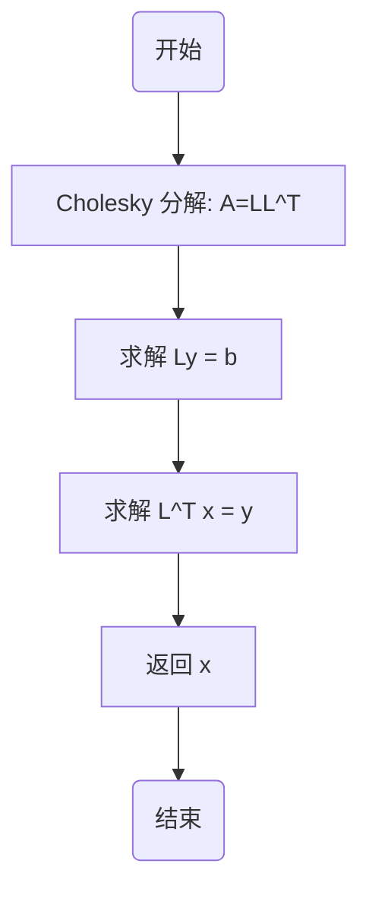
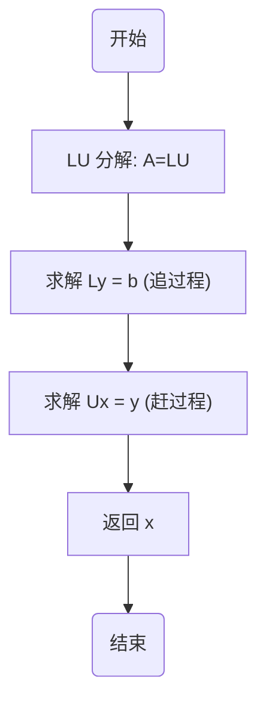
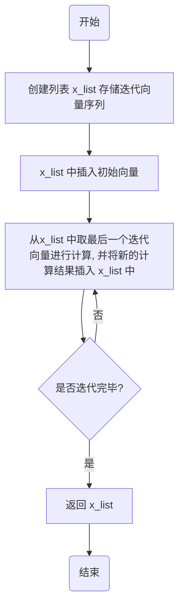
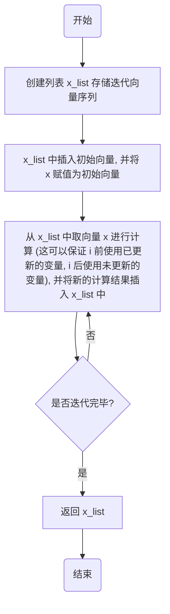
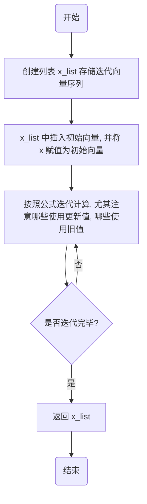

# 1 问题重述
查找资料寻找具体实例，分别应用直接法 (Doolittle、Crout、对称正定矩阵 Cholesky 分解、三对角矩阵追赶法、列主元消去法等) 和迭代法求解线性方程组，并作误差分析，即计算误差范数 $\| x- x^* \|$ 
# 2 具体实例汇总
这里给出了 6 个不同类别和性质的线性方程组实例，每个都有明确的系数矩阵、右端项和精确解，并说明其病态性。
前提说明：这里的误差范数我们采取 2 范数，即 $\| x - x^* \| = \sqrt{\sum\limits_{i=1}^n (x_i-x_i^*)^2}$ 
## 2-1 对称正定、不病态
$$
A_1 = \begin{bmatrix}
5 & 1 & 2 \\
1 & 4 & 1 \\
2 & 1 & 5
\end{bmatrix}, 
\quad b_1 = \begin{bmatrix} 8 \\ 6 \\ 8 \end{bmatrix}
$$
**真解**：$x^* = [1,\ 1,\ 1]^T$ 
**条件数**：$\kappa(A_1) \approx 6.4$ (小，不病态)
**备注**：适合 Cholesky 分解，直接法误差小。
## 2-2 对称正定、病态
$$
A_2 = \begin{bmatrix}
1 & 0.99 \\
0.99 & 1
\end{bmatrix},
b_2 = \begin{bmatrix}
1.99 \\ 1.99
\end{bmatrix}
$$
**真解**：$x^* = [1,1]^T$ 
**条件数**：$\kappa(A2​)\approx199$ (较大，病态)
**备注**：这个矩阵接近奇异，但仍然是正定的。
## 2-3 三对角、不病态
$$
A_3 = \begin{bmatrix}
3 & 1 & 0 & 0 \\
1 & 4 & 1 & 0 \\
0 & 1 & 5 & 1 \\
0 & 0 & 1 & 6
\end{bmatrix},
\quad b_3 = \begin{bmatrix} 4 \\ 6 \\ 7 \\ 7 \end{bmatrix}
$$
**真解**：$x^* = [1,\ 1,\ 1,\ 1]^T$
**条件数**：约 9.7（不大）
**备注**：适合追赶法
## 2-4 三对角、病态
$$
A_4 = \begin{bmatrix}
1 & 1 & 0 & 0 \\
1 & 1.001 & 1 & 0 \\
0 & 1 & 1.001 & 1 \\
0 & 0 & 1 & 1
\end{bmatrix},
b_4 = \begin{bmatrix}
3.0 \\ 6.004 \\10.003 \\ 7.0
\end{bmatrix}
$$
**真解**：$x^* = [1,\ 2,\ 3,\ 4]^T$ 
**条件数**：约 $1.0\times 10^5$ 量级（很大，病态）
## 2-5 一般矩阵、不病态
$$
A_5 = \begin{bmatrix}
2 & 3 & 1 \\
4 & 1 & -1 \\
1 & 2 & 3
\end{bmatrix},
\quad b_5 = \begin{bmatrix} 6 \\ 4 \\ 6 \end{bmatrix}
$$
**真解**：$x^* = [1,\ 1,\ 1]^T$
**条件数**：约 $5.1$（小，良态）
**备注**：适合列主元消去、Doolittle、Crout 分解。
## 2-6 一般矩阵、病态
$$
A_6 = \begin{bmatrix}
1 & 0.99 \\
0.99 & 0.98
\end{bmatrix},
b = \begin{bmatrix}
1.99 \\ 1.97
\end{bmatrix}
$$
**真解**：$x^* = [1,\ 1]^T$ 
**条件数**：$\kappa(A_6) \approx 3.9\times 10^4$（病态）
**备注**：矩阵几乎奇异，微小扰动会导致解巨大变化。
# 3 算法基础知识
## 3-1 直接法
- **LU 分解**：Gauss 消去法的实质是将线性代数方程组的系数矩阵分解为两个三角形矩阵的乘积，然后求解。即将矩阵 $A$ 分解为 $A = L \cdot U$，其中 $L$ 为单位下三角阵，$U$ 为上三角阵。
	- *证明过程* 
		事实上，线性方程组 $Ax = b$ 经过 $k$ 步消元过程后，有等价方程 $A_{k}x = b_{k}$，其中 $A_{1} = A$, $b_{1} = b$，而 $A_{k}$ 和 $b_{k}$ 的形式为
		$$
		A_{k} =
		\begin{bmatrix}
		a_{11}^{(1)} & \cdots & \cdots & \cdots & a_{1n}^{(1)} \\
		& \ddots & & \vdots \\
		&& a_{kk}^{(k)} & \cdots & a_{kn}^{(k)} \\
		&& \vdots & & \vdots \\
		&& a_{nk}^{(k)} & \cdots & a_{nn}^{(k)}
		\end{bmatrix},
		\quad
		b_{k} =
		\begin{bmatrix}
		b_{1}^{(k)} \\
		\vdots \\
		b_{k}^{(k)} \\
		\vdots \\
		b_{n}^{(k)}
		\end{bmatrix}
		$$
		可以直接验证 $A_{k+1} = L_{k} \cdot A_{k}, \ b_{k+1} = L_{k} \cdot b_{k}$，其中
		$$
		L_{k}=\left[
		\begin{array}{cccc}
		1\\
		&\ddots\\
		&&1\\ 
		&& -l_{k+1,k}&1\\
		&& \vdots && \ddots \\ 
		&& -l_{n,k} &&& 1 
		\end{array}\right],\quad 
		l_{i,k}=\dfrac{a_{i,k}^{(k)}}{a_{kk}^{(k)}},\ i=k+1,k+2,\cdots,n
		$$
		记 $l_{k} = (0, \cdots, 0, l_{k+1,k}, \cdots, l_{n,k})^{\mathrm{T}},\ k = 1, 2, \cdots, n-1$，则 $L_{k} = I - l_{k} \cdot e_{k}^{\mathrm{T}}$ 
		其中 $e_{k}$ 是第 $k$ 个坐标向量，那么上面定义的矩阵 $A_{k}$ 和向量 $b_{k}$ 可以用 $\boxed{A_{k} = L_{k-1} \cdots L_{1} A,\ b_{k} = L_{k-1} \cdots L_{1} b, \ k = 2, 3, \cdots, n}$ 表示
		由此可见，用矩阵 $L_{1}, L_{2}, \cdots, L_{n-1}$ 依次左乘原给方程组 $Ax = b$ 两边之后，就把它化成等价方程组 $A_{n} x = b_{n}$ 
		乘积 $L_{n-1} \cdots L_{1}$ 是下三角阵，而且对角元全部等于 $1$，因此 $L = [L_{n-1} \cdots L_{1}]^{-1}$ 也是对角元等于 1 的下三角阵
		不难验证 $L_{k}^{-1} = I + l_{k} \cdot e_{k}^{\mathrm{T}}$，因此
		$$
		\begin{aligned}
		L &= [L_{n-1} \cdots L_{1}]^{-1} = L_{1}^{-1} \cdots L_{n-1}^{-1} = I + \sum_{k=1}^{n-1} l_{k} \cdot e_{k}^{\mathrm{T}} \\
		&= \begin{bmatrix}
		1\\
		l_{21} & 1\\
		\vdots &   & \ddots\\
		l_{n1} & \cdots & l_{n,n-1} & 1
		\end{bmatrix}
		\end{aligned}
		$$
		
		注意到 $A_{k} = L_{k-1} \cdots L_{1} A$ 为上三角阵，记 $U = A_{n}$ 
		于是证明了 $A$ 可以分解为一个单位下三角阵与一个上三角阵的乘积，即
		$$
		A = L \cdot U = \left[\begin{array}{cccc}
		1 & 0 & \cdots & 0 \\
		l_{21} & 1 & \cdots & 0 \\
		\vdots & \ddots & \ddots & \vdots \\
		l_{n1} & \cdots & l_{n, n-1} & 1
		\end{array}\right] \cdot \left[\begin{array}{cccc}
		u_{11} & u_{12} & \cdots & u_{1n} \\
		0 & u_{22} & \cdots & u_{2n} \\
		\vdots & \ddots & \ddots & \vdots \\
		0 & \cdots & 0 & u_{nn}
		\end{array}\right]
		$$
		称上述分解为矩阵 $A$ 的 **LU 分解** 
- **定理**：当且仅当 $A$ 的所有顺序主子阵均非奇异时，$A$ 有唯一的 LU 分解。
	- *证明过程* 
		由 $A_{k} = L_{k-1} \cdots L_{1} A,\ b_{k} = L_{k-1} \cdots L_{1} b, \ k = 2, 3, \cdots, n$ 可知 $A = L_{1}^{-1} \cdot L_{2}^{-1} \cdots L_{k-1}^{-1} \cdot A_{k} = \bar{L}_{k} \cdot A_{k}$ 
		其中 $\bar{L}_{k} = \left[\begin{array}{cc} M_{k} & O \\ H_{k} & I_{n-k} \end{array}\right]$，这里
		$$
		M_{k} = \left[\begin{array}{cccc}
		1 &  &  & \\
		l_{21} & 1 &  & \\
		\vdots & \ddots & \ddots &  \\
		l_{k1} & \cdots & l_{k,k-1} & 1
		\end{array}\right], \quad
		H_{k} = \left[\begin{array}{cccc}
		l_{k+1,1} & \cdots & l_{k+1,k-1} & 0 \\
		l_{k+2,1} & \cdots & l_{k+2,k-1} & 0 \\
		\vdots &  & \vdots & \vdots \\
		l_{n1} & \cdots & l_{n,k-1} & 0
		\end{array}\right]
		$$
		写 $A = L_{1}^{-1} \cdot L_{2}^{-1} \cdots L_{k-1}^{-1} \cdot A_{k} = \bar{L}_{k} \cdot A_{k}$ 为分块形式
		$$
		\left[\begin{array}{ll}
		A_{11} & A_{12} \\
		A_{21} & A_{22}
		\end{array}\right] = \left[\begin{array}{cc}
		M_{k} & O \\
		H_{k} & I_{n-k}
		\end{array}\right] \cdot \left[\begin{array}{cc}
		A_{11}^{(k)} & A_{12}^{(k)} \\
		A_{21}^{(k)} & A_{22}^{(k)}
		\end{array}\right] 
		$$
		其中 $A_{11}^{(k)}$ 为 $A_{k}$ 的 $k$ 阶顺序主子阵，$A_{11}$ 为 $A$ 的 $k$ 阶顺序主子阵，于是 $A_{11} = M_{k} \cdot A_{11}^{(k)}$ 
		从而 $\operatorname{det} \left(A_{11}\right) = \operatorname{det} \left( M_{k} \right) \cdot \operatorname{det} \left( A_{11}^{(k)} \right) = \operatorname{det} \left( A_{11}^{(k)} \right) = a_{11}^{(1)}\cdot a_{22}^{(2)}\cdots a_{kk}^{(k)}$ 
		因此 $a_{kk}^{(k)}\neq 0,\ k=1,2,\cdots, n-1$ 
		即 $A$ 有 $LU$ 分解 $\iff$  $A$ 的所有顺序主子阵非奇异。
		最后，假设 $L_{1}U_{1}=L_{2}U_{2}=A$ 是 $A$ 的两个 $LU$ 分解，那么 $B=L_{1}^{-1}\cdot L_{2}=U_{1}\cdot U_{2}^{-1}$ 
		既是对角元等于 $1$ 的上三角阵，又是对角元等于 $1$ 的下三角阵，即 $B=I$，所以 $L_{1}=L_{2},\ U_{1}=U_{2}$
		从而证明了 $LU$ 分解的唯一性。
- **定理**：设 $A$ 非奇异，则存在置换矩阵 $P$，以及元素的绝对值不大于 $1$ 的单位下三角阵 $L$ 和上三角阵 $U$，使 $PA = LU$，并且这种三角分解可由列主元消元法得到
- **Doolittle (杜利特尔) 分解**：当 $A$ 的所有顺序主子阵均非奇异时，可以得到矩阵 $A$ 的唯一 LU 分解，其中 $L$ 为单位下三角阵，$U$ 为一般的上三角阵，并称之为矩阵 $A$ 的 **Doolittle (杜利特尔) 分解** 
- **Crout (克劳特) 分解**：当 $A$ 的所有顺序主子阵均非奇异时，可以得到矩阵 $A$ 的唯一 LU 分解，其中 $L$ 为一般的下三角阵，$U$ 为单位上三角阵，并称之为矩阵 $A$ 的 **Crout (克劳特) 分解** 
- **Cholesky (楚列斯基) 分解**：当 $A$ 为对称正定矩阵时，可以证明 $A$ 存在三角分解 $A = L\cdot L^T$，其中 $L$ 为下三角阵，该分解称为 **Cholesky (楚列斯基) 分解** 
	- *证明过程* 
		事实上，$A$ 存在三角分解 $A = L D U$，又由于 $A^{\mathrm{T}} = A$，则 $U = L^{\mathrm{T}}$，于是得到 $A = L D L^{\mathrm{T}}$，其中 $D = \operatorname{diag}(d_{1}, d_{2}, \cdots, d_{n})$ 
		由于 $A$ 正定，此时有 $d_{i} > 0, \ i = 1, 2, \cdots, n$ 
		因此可取 $D^{1/2} = \operatorname{diag}(d_{1}^{1/2}, d_{2}^{1/2}, \cdots, d_{n}^{1/2})$，并令 $\tilde{L} = L \cdot D^{1/2}$，则有 $A = L D^{1/2} D^{1/2} L^{\mathrm{T}} = (L D^{1/2}) (L D^{1/2})^{\mathrm{T}} = \tilde{L} \cdot \tilde{L}^{\mathrm{T}}$ 
-  **算法** (**Cholesky 分解**)
	下面利用待定系数法给出 $A = L \cdot L^{\mathrm{T}}$ 分解的算法。由	
	$$
	\begin{bmatrix}
	a_{11} & a_{12} & \cdots & a_{1n} \\
	a_{21} & a_{22} & \cdots & a_{2n} \\
	\vdots & \vdots &  & \vdots \\
	a_{n1} & a_{n2} & \cdots & a_{nn}
	\end{bmatrix}
	=
	\begin{bmatrix}
	l_{11} &  &  & 0 \\
	l_{21} & l_{22} &  &  \\
	\vdots & \ddots & \ddots &  \\
	l_{n1} & \cdots & l_{n,n-1} & l_{nn}
	\end{bmatrix}
	\cdot
	\begin{bmatrix}
	l_{11} & l_{21} & \cdots & l_{n1} \\
	 & l_{22} & \ddots & \vdots \\
	 &  & \ddots & l_{n,n-1} \\
	0 &  &  & l_{nn}
	\end{bmatrix}
	$$
	比较上式两边对应的元素，首先有 $l_{11}^{2} = a_{11}$。因为 $A$ 正定，$a_{11} > 0$，故 $l_{11} = \sqrt{a_{11}}$ 
	以 $L$ 的第二行乘 $L^{\mathrm{T}}$ 的前两列，得 $l_{21} \cdot l_{11} = a_{21},\ l_{21}^{2} + l_{22}^{2} = a_{22}$，又可解得未知量 $l_{21}$ 和 $l_{22}$。
	一般地，对 $i = 1, 2, \cdots, n$，有 $l_{ij} = \left[ a_{ij} - \sum\limits_{k=1}^{j-1} l_{ik} l_{jk} \right] \big/ l_{jj},\ j = 1, 2, \cdots, i-1$ 和 $l_{ii} = \left[ a_{ii} - \sum\limits_{k=1}^{i-1} l_{ik}^{2} \right]^{1/2}$ 
	由 $A$ 的正定性可证明上式的平方根中值为正的。
- **三对角矩阵追赶法**：设线性方程组 $Ax=b$ 的系数矩阵 $A$ 为三对角矩阵 $A = \begin{bmatrix} e_1 & f_1 & & 0 \\ d_2 & \ddots & \ddots \\ & \ddots & \ddots & f_{n-1} \\ 0 & & d_n & e_n \end{bmatrix}$，这时 $A$ 可以作如下 LU 分解：$A = LU = \begin{bmatrix} 1 &  &  & 0 \\ l_{2} & 1 &  &  \\ & \ddots & \ddots &  \\ 0 &  & l_{n} & 1 \end{bmatrix} \cdot \begin{bmatrix} r_{1} & f_{1} &  & 0 \\ & r_{2} & \ddots &  \\ &  & \ddots & f_{n-1} \\ 0 &  &  & r_{n} \end{bmatrix}$ 
- **算法**(**求解三对角方程组的追赶法**)：求解上述方程组的相应 Gauss 消去法的变形算法
	1.  **LU 分解** (**Doolittle 分解**)：$r_{1} = e_{1}$，对 $i = 2, 3, \cdots, n$ 计算 $l_{i} = \dfrac{d_{i}}{r_{i-1}},\ r_{i} = e_{i} - l_{i} \times f_{i-1}$ 
	2. **解** $Ly = b$ (**“追”过程**)：$y_{1} = b_{1}$，对 $i = 2, 3, \cdots, n$ 计算 $y_{i} = b_{i} - l_{i} \times y_{i-1}$ 
	3. **解** $Ux = y$ (**“赶”过程**)：$x_{n} = \dfrac{y_{n}}{r_{n}}$，对 $i = n-1, n-2, \cdots, 1$ 计算 $x_{i} = \dfrac{y_{i} - f_{i} \times x_{i+1}}{r_{i}}$
	- 追赶法的运算数量级为 $O(n)$，即为一种具有最优运算量的算法。
## 3-2 迭代法
- **Jacobi 迭代法**：关于一般的 $n$ 阶线性代数方程组，其相应的 **Jacobi 迭代算法**为 $x_i^{k+1} = \dfrac{1}{a_{ii}} \left( b_{i} - \sum\limits_{j=1}^{i-1} a_{ij}x_{j}^{k} - \sum\limits_{j=i+1}^{n} a_{ij}x_{j}^{k} \right),\ i=1,2,\cdots,n$ 
- **Gauss-Seide 迭代算法**：关于一般的 $n$ 阶线性代数方程组，其相应的 **Gauss-Seide 迭代算法**为 $x_i^{k+1} = \dfrac{b_i - \sum\limits_{j=1}^{i-1} a_{ij} x_j^{k+1} - \sum\limits_{j=i+1}^{n} a_{ij} x_j^{k}}{a_{ii}}, \ i = 1, 2, \cdots, n$ 
- **超松弛迭代** (**SOR 迭代**)：作为 G-S 迭代法的推广（或加速），有如下迭代法：$x_i^{k+1} = \omega \dfrac{b_i - \sum\limits_{j=1}^{i-1} a_{ij} x_j^{k+1} - \sum\limits_{j=i+1}^{n} a_{ij} x_j^{k}}{a_{ii}} + (1 - \omega) x_i^{k},\ i = 1, 2, \cdots, n$，今后为了描述方便，将该迭代式统称为**超松弛迭代** 
	- 它可以视为 G-S 迭代分量与上一步迭代分量的一种组合式
	- **松弛因子**：其中 $\omega \in \mathbb{R}$ 被称为**松弛因子** 
	- **超松弛迭代**：特别当 $\omega > 1$ 时，该迭代式被称为**超松弛迭代** 
	- **低松弛迭代**：当 $\omega < 1$ 时被称为**低松弛迭代** 
	- **G-S 迭代**：$\omega = 1$ 时就是 **G-S 迭代** 
- **迭代矩阵**：利用 $A=M-N$，方程组 $Ax = b$ 可等价地写为 $x = M^{-1} N x + M^{-1} b$，由此得到迭代算法 $\boxed{x^{k+1} = M^{-1} N x^{k} + M^{-1} b = G x^{k} + M^{-1} b \quad (*)}$，其中矩阵 $G = M^{-1} N$ 称为该迭代法 $(*)$ 的**迭代矩阵**。
	- 令矩阵 $A = D - L - U$，其中 $D, -L, -U$ 分别为矩阵 $A$ 的对角矩阵和严格下、上三角阵
- *结论*：对上述三种迭代法，相应的矩阵分解式和迭代矩阵分别如下：
	- **Jacobi 迭代法**：$M = D,\ N = L + U,\ G = D^{-1}(L + U) = I - D^{-1}A$ 
	- **G-S 迭代法**：$M = D - L,\ N = U,\ G = (D - L)^{-1}U$ 
	- **SOR 迭代法**：它是通过对原方程组 $Ax = b$ 的等价方程组 $\omega Ax = \omega b,\ \omega \neq 0$ 的系数矩阵 $\omega A$ 作如下矩阵分裂：$M = D - \omega L,\ N = (1 - \omega) D + \omega U$ 得到的。这时其迭代矩阵为 $G = (D - \omega L)^{-1} \left[ (1 - \omega) D + \omega U \right]$ 
- **收敛性定理**：对于任何初始向量 $x^{0}$，迭代法 $\boxed{x^{k+1} = M^{-1} N x^{k} + M^{-1} b = G x^{k} + M^{-1} b\ (*)}$ 收敛 $\iff$ $\rho(G) < 1$ 
- **最佳松弛因子**：为了使 SOR 迭代法收敛得快，应选择参数 $\omega^{*}$ 使得 $\rho(G_{\omega^{*}}) = \min\limits_{0<\omega<2} \rho(G_{\omega})$，$\omega^{*}$ 称为**最佳松弛因子** 
	- *可以证明*：如果系数矩阵 $A$ 具有性质 A 且对角线元素全不为零，而 Jacobi 迭代矩阵 $G_{J}$ 的特征值全为实数且 $\rho(G_{J}) < 1$，那么当 $\omega \in (0,2)$ 时，SOR 迭代法收敛，其最佳松弛因子为 $\omega^{*} = \dfrac{2}{1 + \sqrt{1 - \rho^{2}(G_{J})}}$ 
## 3-3 误差分析
- **病态系统** (**不稳定系统**)、**良态系统** (**稳定系统**)：若方程组的解向量对系数矩阵和右端的扰动很敏感，常称之为**病态系统** (**不稳定系统**)，否则称之为**良态系统** (**稳定系统**)
- *结论*：若 $\operatorname{cond}(A)$ 很大，则 $b$ 的微小的相对扰动，也可能使 $Ax=b$ 的解产生相当大的相对扰动。
	- *推导过程* 
		设方程组的右端存在误差（或扰动）$\delta b$，引起解的误差为 $\delta x$，则有 $A(x+\delta x)=b+\delta b$ 
		由此得误差方程  $A\delta x=\delta b,\ \delta x=A^{-1}\delta b$ 
		所以 $\|\delta x\|\leqslant\|A^{-1}\|\cdot\|\delta b\|$ 
		又 $\|b\|\leqslant\|A\|\cdot\|x\|$，假定 $b\neq0$，因而 $x\neq0$，由 $\|\delta x\|\leqslant\|A^{-1}\|\cdot\|\delta b\|$ 得到 $\boxed{\dfrac{\|\delta x\|}{\|x\|}\leqslant\|A\|\cdot\|A^{-1}\|\cdot\dfrac{\|\delta b\|}{\|b\|}\quad(*)}$ 
		即矩阵 $A$ 的条件数 $\|A^{-1}\|\cdot\|A\|$ 决定了方程组的解对右端扰动量的敏感程度
		$(*)$ 表明，若 $\operatorname{cond}(A)$ 很大，则 $b$ 的微小的相对扰动，也可能使 $Ax=b$ 的解产生相当大的相对扰动。
- *结论*：若 $\operatorname{cond}(A)$ 很大，则系数矩阵 $A$ 的微小相对扰动 $\|\delta A\|/\|A\|$，也可能使方程组的解 $x$ 产生相当大的相对扰动。
	- *推导过程* 
		当系数矩阵 $A$ 存在误差 $\delta A$ 时，近似解由方程 $(A+\delta A)(x+\delta x)=b$ 决定。
		由于 $\delta A$ 是微小扰动，可以假设 $\left\| A^{-1} \right\| \cdot \left\| \delta A \right\| < 1$ 
		这时由前面定理知 $A + \delta A$ 是非奇异的。
		将方程组 $(A+\delta A)(x+\delta x)=b$ 减去 $Ax=b$，得 $\delta x = -A^{-1} \delta A \cdot x - A^{-1} \delta A \cdot \delta x$ 
		于是 $\left\| \delta x \right\| \leqslant \left\| A^{-1} \right\| \cdot \left\| \delta A \right\| \cdot \left\| x \right\| + \left\| A^{-1} \right\| \cdot \left\| \delta A \right\| \cdot \left\| \delta x \right\|$ 或 $\left( 1 - \left\| A^{-1} \right\| \cdot \left\| \delta A \right\| \right) \left\| \delta x \right\| \leqslant \left\| A^{-1} \right\| \cdot \left\| \delta A \right\| \cdot \| x \|$ 
		由此可得 $\dfrac{\left\| \delta x \right\|}{\| x \|} \leqslant \dfrac{\left\| A^{-1} \right\| \cdot \left\| \delta A \right\|}{1 - \left\| A^{-1} \right\| \cdot \left\| \delta A \right\|} = \dfrac{\left\| A^{-1} \right\| \cdot \left\| A \right\| \left( \left\| \delta A \right\| / \left\| A \right\| \right)}{1 - \left\| A^{-1} \right\| \cdot \left\| A \right\| \left( \left\| \delta A \right\| / \left\| A \right\| \right)}$ 
		利用 $\operatorname{cond}(A) = \left\| A \right\| \cdot \left\| A^{-1} \right\|$，可进一步得 $\dfrac{\| \delta x \|}{\| x \|} \leqslant \dfrac{\operatorname{cond}(A) \dfrac{\left\| \delta A \right\|}{\left\| A \right\|}}{1 - \operatorname{cond}(A) \dfrac{\left\| \delta A \right\|}{\left\| A \right\|}}$ 
- *条件数的重要性*：大量实际计算的经验证实，条件数刻画了扰动对方程组解的影响程度。通常条件数越大，扰动对解的影响越大。
- **病态方程组**：常称条件数很大的方程组为**病态方程组** 
- *结论*：Gauss 消去法计算解 $\tilde{x}$ 关于真解的相对扰动量的估计式为 $\dfrac{\|x - \tilde{x}\|_{\infty}}{\|x\|_{\infty}} \leqslant \dfrac{\operatorname{cond}_{\infty}(A)}{1 - \operatorname{cond}_{\infty}(A) \dfrac{\|\delta A\|_{\infty}}{\|A\|_{\infty}}} \left[ 1.01 \left( n^{3} + 3n^{2} \right) \rho \mu \right]$，其中：
	- $\rho = \dfrac{1}{\|A\|_{\infty}} \max\limits_{1 \leqslant i,j,k \leqslant n} \left| a_{ij}^{(k)} \right|$，其中 $a_{i,j}^{(k)}$ 表示 Gauss 消元过程中，矩阵 $A_{k}$ 的元素
	- $\mu$ 表示所使用计算机上的单位舍入误差或截断误差，如在十进制且 16 位字长的计算机上，$\mu < 10^{-15}$ 
# 4 Doolittle 法求解 6 个线性方程组并作误差分析
## 4-1 算法实现逻辑
函数 `doolittle_decomposition(A, b)` 负责求线性方程组 $Ax=b$ 
先将矩阵 LU 分解为
$$
\begin{bmatrix} a_{11} & a_{12} & \cdots & a_{1n} \\ a_{21} & a_{22} & \cdots & a_{2n} \\ \vdots & \vdots &  & \vdots \\ a_{n1} & a_{n2} & \cdots & a_{nn} \end{bmatrix} = \begin{bmatrix} 1 &  &  & 0 \\ l_{21} & 1 &  &  \\  \vdots & \ddots & \ddots \\ l_{n1} & \cdots & l_{n,n-1} & 1 \end{bmatrix} \cdot \begin{bmatrix} u_{11} & u_{12} & \cdots & u_{1n} \\  &   u_{22} & \cdots & u_{2n} \\  &  & \ddots & \vdots \\ 0 &  &    & u_{nn} \end{bmatrix}
$$
再进行回代，即解方程组 $Ux = L^{-1}b$，它等价于求解如下两个具有三角形系数矩阵的方程组 $Ux = z,\ Lz = b$ 
## 4-2 相关函数的伪代码、源代码
### 4-2-1 `doolittle_decomposition(A, b)` 
该函数的伪代码如下：
```python
for k = 0,1,...,n-2
	for i = k+1,k+2,...,n-1
		a[i][k] = a[i][k] / a[k][k]
		for j = k+1,k+2,...,n-1
			a[i][j] = a[i][j] - a[i][k] * a[k][j]
```

该函数的源代码如下：
```python
def doolittle_decomposition(A, b):
  '''
  用 doolittle 分解法求线性代数方程组 Ax=b 的解并返回
  :param A: 二维numpy数组, 存储系数矩阵
  :param b: 一维numpy数组, 存储右端向量
  :return: 一维numpy数组, 表示得到的解
  '''
  n = len(b)
  LU = A.copy().astype(float)
  
  # Doolittle 分解: A = LU
  for k in range(n-1):
    for i in range(k+1, n):
      LU[i, k] = LU[i, k] / LU[k, k]
      for j in range(k+1, n):
        LU[i, j] = LU[i, j] - LU[i, k] * LU[k, j]
  
  # 前代求解 Ly = b
  y = b.copy().astype(float)
  for i in range(1, n):
    for j in range(i):
      y[i] = y[i] - LU[i, j] * y[j]
  
  # 回代求解 Ux = y
  x = y.copy()
  for i in range(n-1, -1, -1):
    for j in range(i+1, n):
        x[i] = x[i] - LU[i, j] * x[j]
    x[i] = x[i] / LU[i, i]
  return x
```
## 4-3 结果展示
代码输出为：
```python
第1个方程组通过doolittle分解法得到的解为:[1. 1. 1.]
精确解为:[1 1 1]
误差范数(2范数)为:3.1401849173675503e-16

第2个方程组通过doolittle分解法得到的解为:[1. 1.]
精确解为:[1 1]
误差范数(2范数)为:0.0

第3个方程组通过doolittle分解法得到的解为:[1. 1. 1. 1.]
精确解为:[1 1 1 1]
误差范数(2范数)为:3.1401849173675503e-16

第4个方程组通过doolittle分解法得到的解为:[1.00000053e-06 2.99999900e+00 3.00100000e+00 3.99900000e+00]
精确解为:[1 2 3 4]
误差范数(2范数)为:1.4142128552675135

第5个方程组通过doolittle分解法得到的解为:[1. 1. 1.]
精确解为:[1 1 1]
误差范数(2范数)为:0.0

第6个方程组通过doolittle分解法得到的解为:[1. 1.]
精确解为:[1 1]
误差范数(2范数)为:0.0
```

可以看到第 4 个方程组误差很大，这是因为它的条件数非常大导致的；其他 5 个方程组得到的结果很精确！
# 5 Crout 法求解 6 个线性方程组并作误差分析
## 5-1 算法实现逻辑
函数 `crout_decomposition(A, b)` 负责求线性方程组 $Ax=b$ 
先将矩阵 LU 分解为
$$
\begin{bmatrix} a_{11} & a_{12} & \cdots & a_{1n} \\ a_{21} & a_{22} & \cdots & a_{2n} \\ \vdots & \vdots &  & \vdots \\ a_{n1} & a_{n2} & \cdots & a_{nn} \end{bmatrix} = \begin{bmatrix} l_{11} &  &  & 0 \\ l_{21} & l_{22} \\ \vdots & \vdots & \ddots \\ l_{n1} & l_{n2} & \cdots & l_{nn} \end{bmatrix} \cdot \begin{bmatrix} 1 & u_{12} & \cdots & u_{1n} \\  & 1 & \cdots & u_{2n} \\  &  & \ddots & \vdots \\ 0 &  &  & 1 \end{bmatrix}
$$
再进行回代，即解方程组 $Ux = L^{-1}b$，它等价于求解如下两个具有三角形系数矩阵的方程组 $Ux = z,\ Lz = b$ 
## 5-2 相关函数的源代码
### 5-2-1 `crout_decomposition(A, b)` 
该函数的伪代码与函数 `doolittle_decomposition(A, b)` 类似，这里就不赘述了
该函数的源代码为：
```python
def crout_decomposition(A, b):
  '''
  用 Crout 分解法求线性代数方程组 Ax=b 的解并返回
  :param A: 二维numpy数组, 存储系数矩阵
  :param b: 一维numpy数组, 存储右端向量
  :return: 一维numpy数组, 表示得到的解
  '''
  n = len(b)
  A = A.copy().astype(float)
  
  # 初始化L和U的存储
  # 在Crout分解中，我们将L和U存储在同一个矩阵中
  # 其中L的对角线以下（包括对角线）存储L，U的对角线以上存储U
  LU = A.copy().astype(float)
  
  # Crout分解: A = LU, 其中U的对角线元素为1
  for k in range(n):
    # 计算L的列（从对角线到下面）
    for i in range(k, n):
      for j in range(k):
        LU[i, k] -= LU[i, j] * LU[j, k]
    # 计算U的行（从对角线右边）
    for j in range(k+1, n):
      for i in range(k):
        LU[k, j] -= LU[k, i] * LU[i, j]
      LU[k, j] /= LU[k, k]  # 除以L的对角线元素
  
  # 前代求解 Ly = b
  y = b.copy().astype(float)
  for i in range(n):
    for j in range(i):
      y[i] -= LU[i, j] * y[j]
    y[i] /= LU[i, i]  # 除以L的对角线元素
  
  # 回代求解 Ux = y
  x = y.copy()
  for i in range(n-1, -1, -1):
    for j in range(i+1, n):
      x[i] -= LU[i, j] * x[j]
    # U[i, i] = 1, 所以不需要除以对角线元素
  return x
```
## 5-3 结果展示
代码输出为：
```python
第1个方程组通过crout分解法得到的解为:[1. 1. 1.]
精确解为:[1 1 1]
误差范数(2范数)为:3.1401849173675503e-16

第2个方程组通过crout分解法得到的解为:[1. 1.]
精确解为:[1 1]
误差范数(2范数)为:0.0

第3个方程组通过crout分解法得到的解为:[1. 1. 1. 1.]
精确解为:[1 1 1 1]
误差范数(2范数)为:4.1540741810552243e-16

第4个方程组通过crout分解法得到的解为:[1.00000079e-06 2.99999900e+00 3.00100000e+00 3.99900000e+00]
精确解为:[1 2 3 4]
误差范数(2范数)为:1.4142128552671367

第5个方程组通过crout分解法得到的解为:[1. 1. 1.]
精确解为:[1 1 1]
误差范数(2范数)为:0.0

第6个方程组通过crout分解法得到的解为:[1. 1.]
精确解为:[1 1]
误差范数(2范数)为:0.0
```

和 Dolittle 分解一样，可以看到第 4 个方程组误差很大，这是因为它的条件数非常大导致的；其他 5 个方程组得到的结果很精确！
# 6 Cholesky 法求解 2 个对称正定线性方程组并作误差分析
## 6-1 算法实现逻辑
函数 `cholesky_decomposition(A, b)` 负责用 Cholesky 分解法求解对称正定矩阵 $A$ 对应的线性方程组 $Ax=b$ 的解，具体实现方法如下
$A$ 为对称正定矩阵，令
$$
\begin{bmatrix}
a_{11} & a_{12} & \cdots & a_{1n} \\
a_{21} & a_{22} & \cdots & a_{2n} \\
\vdots & \vdots &  & \vdots \\
a_{n1} & a_{n2} & \cdots & a_{nn}
\end{bmatrix}
=
\begin{bmatrix}
l_{11} &  &  & 0 \\
l_{21} & l_{22} &  &  \\
\vdots & \ddots & \ddots &  \\
l_{n1} & \cdots & l_{n,n-1} & l_{nn}
\end{bmatrix}
\cdot
\begin{bmatrix}
l_{11} & l_{21} & \cdots & l_{n1} \\
& l_{22} & \ddots & \vdots \\
&  & \ddots & l_{n,n-1} \\
0 &  &  & l_{nn}
\end{bmatrix}
$$
对 $i = 1, 2, \cdots, n$，有 $l_{ij} = \left[ a_{ij} - \sum\limits_{k=1}^{j-1} l_{ik} l_{jk} \right] \big/ l_{jj},\ j = 1, 2, \cdots, i-1$ 和 $l_{ii} = \left[ a_{ii} - \sum\limits_{k=1}^{i-1} l_{ik}^{2} \right]^{1/2}$ 
然后再通过回代过程，即解方程组 $L^Tx = L^{-1}b$，它等价于求解如下两个具有三角形系数矩阵的方程组 $L^Tx = z,\ Lz = b$ 
## 6-2 相关函数的流程图、源代码
### 6-2-1 `cholesky_decomposition(A, b)` 
该函数的流程图为：


该函数的源代码为：
```python
def cholesky_decomposition(A, b):
  '''
  用 Cholesky 分解法求线性代数方程组 Ax=b 的解并返回 (A 必为对称正定矩阵)
  :param A: 二维numpy数组, 存储系数矩阵
  :param b: 一维numpy数组, 存储右端向量
  :return: 一维numpy数组, 表示得到的解
  '''
  n = len(b)
  L = np.zeros_like(A, dtype=float)
  
  # Cholesky 分解: A = LL^T
  for i in range(n):
    # 计算 l_ii
    sum_sq = 0.0
    for k in range(i):
      sum_sq += L[i, k] ** 2
    L[i, i] = np.sqrt(A[i, i] - sum_sq)
    # 计算 l_ij (j < i)
    for j in range(i+1, n):
      sum_prod = 0.0
      for k in range(i):
        sum_prod += L[i, k] * L[j, k]
      L[j, i] = (A[j, i] - sum_prod) / L[i, i]
  
  # 求解 Ly = b
  y = b.copy().astype(float)
  for i in range(n):
    for j in range(i):
      y[i] -= L[i, j] * y[j]
    y[i] /= L[i, i]
  
  # 求解 L^T x = y
  x = y.copy()
  for i in range(n-1, -1, -1):
      for j in range(i+1, n):
          x[i] -= L[j, i] * x[j]  # 注意这里用 L[j, i] 而不是 L[i, j]
      x[i] /= L[i, i]
  
  return x
```
## 6-3 结果展示
代码输出为：
```python
第1个方程组通过crout分解法得到的解为:[1. 1. 1.]
精确解为:[1 1 1]
误差范数(2范数)为:3.8459253727671276e-16

第2个方程组通过crout分解法得到的解为:[1. 1.]
精确解为:[1 1]
误差范数(2范数)为:3.1401849173675503e-16
```

注意到，在理论上 Cholesky 分解法在这两个方程组上表现得应该比 Doolittle 和 Crout 分解法要好，但实则恰恰相反，这是为什么？
这是因为 Cholesky 分解对对称正定矩阵的条件数特别敏感，且涉及开方操作，所以有时误差会比 Doolittle 和 Crout 分解法要大
# 7 三对角矩阵追赶法求解 2 个三对角线性方程组并作误差分析
## 7-1 算法实现逻辑
函数 `Thomas_algorithm(A, b)` 负责用三对角矩阵追赶法求解对称正定矩阵 $A$ 对应的线性方程组 $Ax=b$ 的解，具体实现方法如下
设线性方程组 $Ax=b$ 的系数矩阵 $A$ 为三对角矩阵 $A = \begin{bmatrix} e_1 & f_1 & & 0 \\ d_2 & \ddots & \ddots \\ & \ddots & \ddots & f_{n-1} \\ 0 & & d_n & e_n \end{bmatrix}$，这时 $A$ 可以作如下 LU 分解：
$$
A = LU =
\begin{bmatrix} 1 &  &  & 0 \\ l_{2} & 1 &  &  \\ & \ddots & \ddots &  \\ 0 &  & l_{n} & 1 \end{bmatrix} \cdot 
\begin{bmatrix} r_{1} & f_{1} &  & 0 \\ & r_{2} & \ddots &  \\ &  & \ddots & f_{n-1} \\ 0 &  &  & r_{n} \end{bmatrix}
$$
然后按照下述过程求解
1. **LU 分解** (**Doolittle 分解**)：$r_{1} = e_{1}$，对 $i = 2, 3, \cdots, n$ 计算 $l_{i} = \dfrac{d_{i}}{r_{i-1}},\ r_{i} = e_{i} - l_{i} \times f_{i-1}$ 
2. **解** $Ly = b$ (**“追”过程**)：$y_{1} = b_{1}$，对 $i = 2, 3, \cdots, n$ 计算 $y_{i} = b_{i} - l_{i} \times y_{i-1}$ 
3. **解** $Ux = y$ (**“赶”过程**)：$x_{n} = \dfrac{y_{n}}{r_{n}}$，对 $i = n-1, n-2, \cdots, 1$ 计算 $x_{i} = \dfrac{y_{i} - f_{i} \times x_{i+1}}{r_{i}}$
- 追赶法的运算数量级为 $O(n)$，即为一种具有最优运算量的算法。
## 7-2 相关函数的流程图、源代码
### 7-2-1 `thomas_algorithm(A, b)` 
该函数的流程图为：


该函数的源代码为：
```python
def thomas_algorithm(A, b):
  '''
  用三对角矩阵追赶法求线性代数方程组 Ax=b 的解并返回 (A 必为三对角矩阵)
  :param A: 二维numpy数组, 存储系数矩阵
  :param b: 一维numpy数组, 存储右端向量
  :return: 一维numpy数组, 表示得到的解
  '''
  n = len(b)

  # 提取三对角线元素
  d = np.zeros(n, dtype=float)  # 下对角线 d[1:] 有效
  e = np.zeros(n, dtype=float)  # 主对角线
  f = np.zeros(n, dtype=float)  # 上对角线 f[:n-1] 有效
  for i in range(n):
    e[i] = A[i, i]
    if i < n-1:
      f[i] = A[i, i+1]
    if i > 0:
      d[i] = A[i, i-1]
  
  # LU 分解 (Doolittle 分解)
  l = np.zeros(n, dtype=float)  # L的下对角线元素 l[1:] 有效
  r = np.zeros(n, dtype=float)  # U的主对角线元素
  r[0] = e[0]
  for i in range(1, n):
    l[i] = d[i] / r[i-1]
    r[i] = e[i] - l[i] * f[i-1]

  # 解 Ly = b ("追"过程)
  y = b.copy().astype(float)
  for i in range(1, n):
      y[i] = y[i] - l[i] * y[i-1]
  
  # 解 Ux = y ("赶"过程)
  x = y.copy()
  x[n-1] = y[n-1] / r[n-1]
  for i in range(n-2, -1, -1):
    x[i] = (y[i] - f[i] * x[i+1]) / r[i]
  
  return x
```
## 7-3 结果展示
代码输出为：
```python
第3个方程组通过三对角矩阵追赶法得到的解为:[1. 1. 1. 1.]
精确解为:[1 1 1 1]
误差范数(2范数)为:3.1401849173675503e-16

第4个方程组通过三对角矩阵追赶法得到的解为:[1.00000053e-06 2.99999900e+00 3.00100000e+00 3.99900000e+00]
精确解为:[1 2 3 4]
误差范数(2范数)为:1.4142128552675135
```

第 3 个方程组通过三对角矩阵追赶发得到的解误差比其他直接方法要小，是最优的！
由于第 4 个方程组高度病态，所以即使是用三对角矩阵追赶法得到的解仍然不是正确解
# 8 Jacobi 迭代法求解 6 个线性方程组并作误差分析
## 8-1 算法实现逻辑
定义函数 `jacobi_iteration(A, b, x0=None, max_iter=1000)` 负责求线性方程组 $Ax=b$，默认迭代初始值为 $x_0 = 0$，默认最大迭代次数为 1000 次
通过迭代公式 $x_i^{k+1} = \dfrac{1}{a_{ii}} \left( b_{i} - \sum\limits_{j=1}^{i-1} a_{ij}x_{j}^{k} - \sum\limits_{j=i+1}^{n} a_{ij}x_{j}^{k} \right),\ i=1,2,\cdots,n$ 进行迭代，将所有迭代过程中得到的迭代解存入列表中，最终输出结果即可
## 8-2 相关函数的流程图、源代码
### 8-2-1 `jacobi_iteration(A, b, x0=None, max_iter=1000)` 
该函数流程图如下：


该函数源代码如下
```python
def jacobi_iteration(A, b, x0=None, max_iter=1000):
  '''
  从初始值 x0 出发, 用 jacobi 迭代法求解线性代数方程组 Ax=b 的解并返回
  :param A: 二维numpy数组, 存储系数矩阵
  :param b: 一维numpy数组, 存储右端向量
  :param x0: 一维numpy数组, 存储迭代初始值
  :max_iter: 整数, 表示最多迭代次数
  :return: 列表, 列表每一项为numpy数组, 表示所有迭代过程中得到的迭代解
  '''
  n = len(b)
  x_list = []
  if x0 is None:
    x_list.append(np.zeros(n))
  else:
    x_list.append(x0)
  
  for k in range(max_iter):
    x_old = x_list[-1]
    x_new = np.zeros_like(x_old)
    for i in range(n):
      sum_ax = 0 # 用于计算 aij*xj (不含第 i 项)
      for j in range(n):
        if j != i:
          sum_ax += A[i,j] * x_old[j]
      x_new[i] = (b[i] - sum_ax) / A[i,i]
    x_list.append(x_new)
  return x_list
```
## 8-3 结果展示
由于前三个方程满足严格对角占优，所以使用 Jacobi 迭代法可以得到收敛结果，如下图是前三个方程的误差收敛图
![[jacobi_1 2.jpg]]
![[jacobi_2 2.jpg]]
![[jacobi_3 2.jpg]]

而又由于后三个方程不满足严格对角占优条件或接近奇异阵，故使用Jacobi方法不收敛，且迭代过程发散的很严重（注意看纵轴单位可知）
![[jacobi_4 2.jpg]]
![[jacobi_5 2.jpg]]
![[jacobi_6 2.jpg]]
# 9 Gauss-Seide 迭代法求解 6 个线性方程组并作误差分析
## 9-1 算法实现逻辑
定义函数 `gauss_seide_iteration(A, b, x0=None, max_iter=1000)` 负责求线性方程组 $Ax=b$，默认迭代初始值为 $x_0 = 0$，默认最大迭代次数为 1000 次
通过迭代公式 $x_i^{k+1} = \dfrac{b_i - \sum\limits_{j=1}^{i-1} a_{ij} x_j^{k+1} - \sum\limits_{j=i+1}^{n} a_{ij} x_j^{k}}{a_{ii}}, \ i = 1, 2, \cdots, n$ 进行迭代，将所有迭代过程中得到的迭代解存入列表中，最终输出结果即可
## 9-2 相关函数的流程图、源代码
### 9-2-1 `gauss_seide_iteration(A, b, x0=None, max_iter=1000)` 
该函数的流程图如下：


该函数的源代码如下：
```python
def gauss_seide_iteration(A, b, x0=None, max_iter=1000):
  '''
  从初始值 x0 出发, 用 Gauss-Seide 迭代法求解线性代数方程组 Ax=b 的解并返回
  :param A: 二维numpy数组, 存储系数矩阵
  :param b: 一维numpy数组, 存储右端向量
  :param x0: 一维numpy数组, 存储迭代初始值
  :max_iter: 整数, 表示最多迭代次数
  :return: 列表, 列表每一项为numpy数组, 表示所有迭代过程中得到的迭代解
  '''
  n = len(b)
  x_list = []
  if x0 is None:
    x = np.zeros(n)
  else:
    x = x0.copy()
  x_list.append(x.copy())
  
  for k in range(max_iter):
    for i in range(n):
      sum_ax = 0
      for j in range(i): # 使用已更新的分量
        sum_ax += A[i,j] * x[j]
      for j in range(i+1, n): # 使用未更新的分量
        sum_ax += A[i, j] * x[j]
      x[i] = (b[i] - sum_ax) / A[i,i]
    x_list.append(x.copy())
  return x_list
```
## 9-3 结果展示
Gauss-Seidel 迭代法的收敛性不单单取决于矩阵是否病态，而是由矩阵的性质决定的。
由于第一个矩阵对称正定且严格对角占优，故满足 GS 收敛的充分条件，其误差收敛图如下
![[gauss_seide_1.jpg]]

由于第二个矩阵对称正定，虽然不严格对角占优，但对称正定保证了 GS 收敛，其误差收敛图如下
![[gauss_seide_2.jpg]]

由于第三个矩阵严格对角占优，故满足 GS 收敛的充分条件，其误差收敛图如下
![[gauss_seide_3.jpg]]

由于后三个矩阵不对称、不正定、不满足严格对角占优，故不满足任何 GS 收敛的充分条件，很有可能不收敛，其其误差图如下
![[gauss_seide_4.jpg]]
![[gauss_seide_5.jpg]]
![[gauss_seide_6.jpg]]

通过对比 Jacobi 和 GS 迭代法对前三个方程的收敛图可知，GS 在前三个方程中表现得都比 Jacobi 好，因为其收敛速度略快与 Jacobi
# 10 SOR 迭代法求解 6 个线性方程组并作误差分析
## 10-1 算法实现逻辑
定义函数 `SOR_iteration(A, b, omega=1, x0=None, max_iter=1000)` 负责求线性方程组 $Ax=b$，默认 $\omega=1$，迭代初始值为 $x_0 = 0$，默认最大迭代次数为 1000 次
通过迭代公式 $x_i^{k+1} = \omega \dfrac{b_i - \sum\limits_{j=1}^{i-1} a_{ij} x_j^{k+1} - \sum\limits_{j=i+1}^{n} a_{ij} x_j^{k}}{a_{ii}} + (1 - \omega) x_i^{k},\ i = 1, 2, \cdots, n$ 进行迭代，将所有迭代过程中得到的迭代解存入列表中，最终输出结果即可
## 10-2 相关函数的流程图、源代码
### 10-2-1 `SOR_iteration(A, b, omega=1, x0=None, max_iter=1000)` 
该函数的流程图如下：


该函数的源代码如下：
```python
def SOR_iteration(A, b, omega=1, x0=None, max_iter=1000):
  '''
  从初始值 x0 出发, 用 SOR 迭代法求解线性代数方程组 Ax=b 的解并返回
  :param A: 二维numpy数组, 存储系数矩阵
  :param b: 一维numpy数组, 存储右端向量
  :param omega: 浮点数, 松弛因子
  :param x0: 一维numpy数组, 存储迭代初始值
  :param max_iter: 整数, 表示最多迭代次数
  :return: 列表, 列表每一项为numpy数组, 表示所有迭代过程中得到的迭代解
  '''
  n = len(b)
  x_list = []
  if x0 is None:
    x = np.zeros(n)
  else:
    x = x0.copy()
  x_list.append(x.copy())
  
  for k in range(max_iter):
    for i in range(n):
      xi_old = x[i]  # 只保存当前分量的旧值
      sum_ax = 0
      for j in range(i):  # 使用已更新的分量
        sum_ax += A[i, j] * x[j]
      for j in range(i+1, n):  # 使用未更新的分量
        sum_ax += A[i, j] * x[j]      
      # 计算 Gauss-Seidel 分量
      gs_component = (b[i] - sum_ax) / A[i, i]
      # 计算 SOR 分量: ω * GS分量 + (1-ω) * 旧分量
      x[i] = omega * gs_component + (1 - omega) * xi_old
    x_list.append(x.copy())
  return x_list
```
## 10-3 结果展示
前三个方程组直接取 $\omega=1$ 即可，因为 GS 迭代法已经足够优秀，误差收敛图同 GS 中误差收敛图
可以验证，第四个方程组不满足 SOR 收敛性，故无论 $\omega$ 取多少，都无法收敛，当 $\omega=0.1$ 时，其收敛图如下图
![[SOR_4.jpg]]
第五个方程组，在实践中若取 $\omega=0.01$，虽然无法收敛，但在迭代 350 次左右时误差达到最小，此时的解也较为接近精确解
![[SOR_5.jpg]]
第六个方程组，在实践中若取 $\omega=0.01$，效果很好！
![[SOR_6.jpg]]
# 11 附录
本次实验报告在文件夹 `experiment_report_3` 下共有 `linear_system.py`、`function.py`、`doolittle_decomposition.py`、`crout_decomposition.py`、`cholesky_decomposition.py`、`thomas_algorithm.py`、`jacobi_iteration.py`、`gauss_seide_iteration.py`、`SOR_iteration.py` 共 9 个 python 文件

`linear_system.py` 源代码为：
```python
import numpy as np
def get_linear_system_1():
  '''
  返回第 1 个线性方程组相关参数
  :return: 返回3个参数, 第一个参数为二维numpy数组A, 表示系数矩阵; 第二个参数为一维numpy数组b, 表示右端项; 第三个参数为一维numpy数组ans, 表示精确解
  '''
  A = np.array([
    [5, 1, 2],
    [1, 4, 1],
    [2, 1, 5]
  ])
  b = np.array([8, 6, 8])
  ans = np.array([1, 1, 1])
  return A, b, ans

def get_linear_system_2():
  '''
  返回第 2 个线性方程组相关参数
  :return: 返回3个参数, 第一个参数为二维numpy数组A, 表示系数矩阵; 第二个参数为一维numpy数组b, 表示右端项; 第三个参数为一维numpy数组ans, 表示精确解
  '''
  A = np.array([
    [1, 0.99],
    [0.99, 1]
  ])
  b = np.array([1.99, 1.99])
  ans = np.array([1, 1])
  return A, b, ans

def get_linear_system_3():
  '''
  返回第 3 个线性方程组相关参数
  :return: 返回3个参数, 第一个参数为二维numpy数组A, 表示系数矩阵; 第二个参数为一维numpy数组b, 表示右端项; 第三个参数为一维numpy数组ans, 表示精确解
  '''
  A = np.array([
    [3, 1, 0, 0],
    [1, 4, 1, 0],
    [0, 1, 5, 1],
    [0, 0, 1, 6]
  ])
  b = np.array([4, 6, 7, 7])
  ans = np.array([1, 1, 1, 1])
  return A, b, ans

def get_linear_system_4():
  '''
  返回第 4 个线性方程组相关参数
  :return: 返回3个参数, 第一个参数为二维numpy数组A, 表示系数矩阵; 第二个参数为一维numpy数组b, 表示右端项; 第三个参数为一维numpy数组ans, 表示精确解
  '''
  A = np.array([
    [1, 1, 0, 0],
    [1, 1.001, 1, 0],
    [0, 1, 1.001, 1],
    [0, 0, 1, 1]
  ])
  b = np.array([3.0, 6.004, 10.003, 7.0])
  ans = np.array([1, 2, 3, 4])
  return A, b, ans

def get_linear_system_5():
  '''
  返回第 5 个线性方程组相关参数
  :return: 返回3个参数, 第一个参数为二维numpy数组A, 表示系数矩阵; 第二个参数为一维numpy数组b, 表示右端项; 第三个参数为一维numpy数组ans, 表示精确解
  '''
  A = np.array([
    [2, 3, 1],
    [4, 1, -1],
    [1, 2, 3]
  ])
  b = np.array([6, 4, 6])
  ans = np.array([1, 1, 1])
  return A, b, ans

def get_linear_system_6():
  '''
  返回第 6 个线性方程组相关参数
  :return: 返回3个参数, 第一个参数为二维numpy数组A, 表示系数矩阵; 第二个参数为一维numpy数组b, 表示右端项; 第三个参数为一维numpy数组ans, 表示精确解
  '''
  A = np.array([
    [1, 0.99],
    [0.99, 0.98],
  ])
  b = np.array([1.99, 1.97])
  ans = np.array([1, 1])
  return A, b, ans
```

`function.py` 源代码为：
```python
import numpy as np
import matplotlib.pyplot as plt
plt.rcParams["font.family"] = ["SimHei"]
plt.rcParams["axes.unicode_minus"] = False

def get_error_norm(exact_vec, approx_vec):
  '''
  :param exact_vec: 一维numpy数组, 精确解向量
  :param approx_vec: 一维numpy数组, 近似解向量
  '''
  x1 = exact_vec
  x2 = approx_vec
  sum = 0
  for i in range(len(x1)):
    sum += (x1[i]-x2[i])**2
  return sum**0.5

def plot_the_error_plot(exact_vec, approx_vec_list, file_name='./images/temp.jpg'):
  '''
  画出一组迭代过程中误差随着迭代过程的变化图
  :param exact_vec: 一维numpy数组, 精确解
  :param approx_vec_list: list, 为整个迭代过程的迭代解
  :param file_name: str, 保存文件目录及名称, 默认为 ./images/temp.jpg
  :return: 画出对应误差线图, 无返回值
  '''
  plt.figure(figsize=(10, 6))
  # 计算每个迭代步的误差
  errors = []
  for approx_vec in approx_vec_list:
      error = get_error_norm(exact_vec, approx_vec)
      errors.append(error)
  plt.plot(errors)
  plt.xlabel('迭代步数', fontsize=14, fontweight='bold')
  plt.ylabel('误差范数 (2范数)', fontsize=14, fontweight='bold')
  plt.title('误差收敛图', fontsize=16, fontweight='bold')
  # 添加网格
  plt.grid(True, alpha=0.3, linestyle='--')
  # 调整布局
  plt.tight_layout()
  # 保存图片
  plt.savefig(fname=file_name, dpi=400)

def doolittle_decomposition(A, b):
  '''
  用 doolittle 分解法求线性代数方程组 Ax=b 的解并返回
  :param A: 二维numpy数组, 存储系数矩阵
  :param b: 一维numpy数组, 存储右端向量
  :return: 一维numpy数组, 表示得到的解
  '''
  n = len(b)
  LU = A.copy().astype(float)

  # Doolittle 分解: A = LU
  for k in range(n-1):
    for i in range(k+1, n):
      LU[i, k] = LU[i, k] / LU[k, k]
      for j in range(k+1, n):
        LU[i, j] = LU[i, j] - LU[i, k] * LU[k, j]
  
  # 前代求解 Ly = b
  y = b.copy().astype(float)
  for i in range(1, n):
    for j in range(i):
      y[i] = y[i] - LU[i, j] * y[j]
  
  # 回代求解 Ux = y
  x = y.copy()
  for i in range(n-1, -1, -1):
    for j in range(i+1, n):
        x[i] = x[i] - LU[i, j] * x[j]
    x[i] = x[i] / LU[i, i]
  return x

def crout_decomposition(A, b):
  '''
  用 Crout 分解法求线性代数方程组 Ax=b 的解并返回
  :param A: 二维numpy数组, 存储系数矩阵
  :param b: 一维numpy数组, 存储右端向量
  :return: 一维numpy数组, 表示得到的解
  '''
  n = len(b)
  A = A.copy().astype(float)
  
  # 初始化L和U的存储
  # 在Crout分解中，我们将L和U存储在同一个矩阵中
  # 其中L的对角线以下（包括对角线）存储L，U的对角线以上存储U
  LU = A.copy().astype(float)
  
  # Crout分解: A = LU, 其中U的对角线元素为1
  for k in range(n):
    # 计算L的列（从对角线到下面）
    for i in range(k, n):
      for j in range(k):
        LU[i, k] -= LU[i, j] * LU[j, k]
    # 计算U的行（从对角线右边）
    for j in range(k+1, n):
      for i in range(k):
        LU[k, j] -= LU[k, i] * LU[i, j]
      LU[k, j] /= LU[k, k]  # 除以L的对角线元素
  
  # 前代求解 Ly = b
  y = b.copy().astype(float)
  for i in range(n):
    for j in range(i):
      y[i] -= LU[i, j] * y[j]
    y[i] /= LU[i, i]  # 除以L的对角线元素
  
  # 回代求解 Ux = y
  x = y.copy()
  for i in range(n-1, -1, -1):
    for j in range(i+1, n):
      x[i] -= LU[i, j] * x[j]
    # U[i, i] = 1, 所以不需要除以对角线元素
  return x

def cholesky_decomposition(A, b):
  '''
  用 Cholesky 分解法求线性代数方程组 Ax=b 的解并返回 (A 必为对称正定矩阵)
  :param A: 二维numpy数组, 存储系数矩阵
  :param b: 一维numpy数组, 存储右端向量
  :return: 一维numpy数组, 表示得到的解
  '''
  n = len(b)
  L = np.zeros_like(A, dtype=float)
  
  # Cholesky 分解: A = LL^T
  for i in range(n):
    # 计算 l_ii
    sum_sq = 0.0
    for k in range(i):
      sum_sq += L[i, k] ** 2
    L[i, i] = np.sqrt(A[i, i] - sum_sq)
    # 计算 l_ij (j < i)
    for j in range(i+1, n):
      sum_prod = 0.0
      for k in range(i):
        sum_prod += L[i, k] * L[j, k]
      L[j, i] = (A[j, i] - sum_prod) / L[i, i]
  
  # 求解 Ly = b
  y = b.copy().astype(float)
  for i in range(n):
    for j in range(i):
      y[i] -= L[i, j] * y[j]
    y[i] /= L[i, i]
  
  # 求解 L^T x = y
  x = y.copy()
  for i in range(n-1, -1, -1):
      for j in range(i+1, n):
          x[i] -= L[j, i] * x[j]  # 注意这里用 L[j, i] 而不是 L[i, j]
      x[i] /= L[i, i]
  
  return x

def thomas_algorithm(A, b):
  '''
  用三对角矩阵追赶法求线性代数方程组 Ax=b 的解并返回 (A 必为三对角矩阵)
  :param A: 二维numpy数组, 存储系数矩阵
  :param b: 一维numpy数组, 存储右端向量
  :return: 一维numpy数组, 表示得到的解
  '''
  n = len(b)

  # 提取三对角线元素
  d = np.zeros(n, dtype=float)  # 下对角线 d[1:] 有效
  e = np.zeros(n, dtype=float)  # 主对角线
  f = np.zeros(n, dtype=float)  # 上对角线 f[:n-1] 有效
  for i in range(n):
    e[i] = A[i, i]
    if i < n-1:
      f[i] = A[i, i+1]
    if i > 0:
      d[i] = A[i, i-1]
  
  # LU 分解 (Doolittle 分解)
  l = np.zeros(n, dtype=float)  # L的下对角线元素 l[1:] 有效
  r = np.zeros(n, dtype=float)  # U的主对角线元素
  r[0] = e[0]
  for i in range(1, n):
    l[i] = d[i] / r[i-1]
    r[i] = e[i] - l[i] * f[i-1]

  # 解 Ly = b ("追"过程)
  y = b.copy().astype(float)
  for i in range(1, n):
      y[i] = y[i] - l[i] * y[i-1]
  
  # 解 Ux = y ("赶"过程)
  x = y.copy()
  x[n-1] = y[n-1] / r[n-1]
  for i in range(n-2, -1, -1):
    x[i] = (y[i] - f[i] * x[i+1]) / r[i]
  
  return x

def jacobi_iteration(A, b, x0=None, max_iter=1000):
  '''
  从初始值 x0 出发, 用 jacobi 迭代法求解线性代数方程组 Ax=b 的解并返回
  :param A: 二维numpy数组, 存储系数矩阵
  :param b: 一维numpy数组, 存储右端向量
  :param x0: 一维numpy数组, 存储迭代初始值
  :max_iter: 整数, 表示最多迭代次数
  :return: 列表, 列表每一项为numpy数组, 表示所有迭代过程中得到的迭代解
  '''
  n = len(b)
  x_list = []
  if x0 is None:
    x_list.append(np.zeros(n))
  else:
    x_list.append(x0)
  
  for k in range(max_iter):
    x_old = x_list[-1]
    x_new = np.zeros_like(x_old)
    for i in range(n):
      sum_ax = 0 # 用于计算 aij*xj (不含第 i 项)
      for j in range(n):
        if j != i:
          sum_ax += A[i,j] * x_old[j]
      x_new[i] = (b[i] - sum_ax) / A[i,i]
    x_list.append(x_new)
  return x_list

def gauss_seide_iteration(A, b, x0=None, max_iter=1000):
  '''
  从初始值 x0 出发, 用 Gauss-Seide 迭代法求解线性代数方程组 Ax=b 的解并返回
  :param A: 二维numpy数组, 存储系数矩阵
  :param b: 一维numpy数组, 存储右端向量
  :param x0: 一维numpy数组, 存储迭代初始值
  :max_iter: 整数, 表示最多迭代次数
  :return: 列表, 列表每一项为numpy数组, 表示所有迭代过程中得到的迭代解
  '''
  n = len(b)
  x_list = []
  if x0 is None:
    x = np.zeros(n)
  else:
    x = x0.copy()
  x_list.append(x.copy())
  
  for k in range(max_iter):
    for i in range(n):
      sum_ax = 0
      for j in range(i): # 使用已更新的分量
        sum_ax += A[i,j] * x[j]
      for j in range(i+1, n): # 使用未更新的分量
        sum_ax += A[i, j] * x[j]
      x[i] = (b[i] - sum_ax) / A[i,i]
    x_list.append(x.copy())
  return x_list

def SOR_iteration(A, b, omega=1, x0=None, max_iter=1000):
  '''
  从初始值 x0 出发, 用 SOR 迭代法求解线性代数方程组 Ax=b 的解并返回
  :param A: 二维numpy数组, 存储系数矩阵
  :param b: 一维numpy数组, 存储右端向量
  :param omega: 浮点数, 松弛因子
  :param x0: 一维numpy数组, 存储迭代初始值
  :param max_iter: 整数, 表示最多迭代次数
  :return: 列表, 列表每一项为numpy数组, 表示所有迭代过程中得到的迭代解
  '''
  n = len(b)
  x_list = []
  if x0 is None:
    x = np.zeros(n)
  else:
    x = x0.copy()
  x_list.append(x.copy())
  
  for k in range(max_iter):
    for i in range(n):
      xi_old = x[i]  # 只保存当前分量的旧值
      sum_ax = 0
      for j in range(i):  # 使用已更新的分量
        sum_ax += A[i, j] * x[j]
      for j in range(i+1, n):  # 使用未更新的分量
        sum_ax += A[i, j] * x[j]      
      # 计算 Gauss-Seidel 分量
      gs_component = (b[i] - sum_ax) / A[i, i]
      # 计算 SOR 分量: ω * GS分量 + (1-ω) * 旧分量
      x[i] = omega * gs_component + (1 - omega) * xi_old
    x_list.append(x.copy())
  return x_list
```

`doolittle_decomposition.py` 源代码为：
```python
import numpy as np
import function as f
import linear_system as q

A, b, exact_vec = q.get_linear_system_1()
approx_vec = f.doolittle_decomposition(A, b)
print(f"第1个方程组通过doolittle分解法得到的解为:{approx_vec}\n精确解为:{exact_vec}\n误差范数(2范数)为:{f.get_error_norm(exact_vec, approx_vec)}\n")

A, b, exact_vec = q.get_linear_system_2()
approx_vec = f.doolittle_decomposition(A, b)
print(f"第2个方程组通过doolittle分解法得到的解为:{approx_vec}\n精确解为:{exact_vec}\n误差范数(2范数)为:{f.get_error_norm(exact_vec, approx_vec)}\n")

A, b, exact_vec = q.get_linear_system_3()
approx_vec = f.doolittle_decomposition(A, b)
print(f"第3个方程组通过doolittle分解法得到的解为:{approx_vec}\n精确解为:{exact_vec}\n误差范数(2范数)为:{f.get_error_norm(exact_vec, approx_vec)}\n")

A, b, exact_vec = q.get_linear_system_4()
approx_vec = f.doolittle_decomposition(A, b)
print(f"第4个方程组通过doolittle分解法得到的解为:{approx_vec}\n精确解为:{exact_vec}\n误差范数(2范数)为:{f.get_error_norm(exact_vec, approx_vec)}\n")

A, b, exact_vec = q.get_linear_system_5()
approx_vec = f.doolittle_decomposition(A, b)
print(f"第5个方程组通过doolittle分解法得到的解为:{approx_vec}\n精确解为:{exact_vec}\n误差范数(2范数)为:{f.get_error_norm(exact_vec, approx_vec)}\n")

A, b, exact_vec = q.get_linear_system_6()
approx_vec = f.doolittle_decomposition(A, b)
print(f"第6个方程组通过doolittle分解法得到的解为:{approx_vec}\n精确解为:{exact_vec}\n误差范数(2范数)为:{f.get_error_norm(exact_vec, approx_vec)}\n")
```

`crout_decomposition.py` 源代码为：
```python
import numpy as np
import function as f
import linear_system as q

A, b, exact_vec = q.get_linear_system_1()
approx_vec = f.crout_decomposition(A, b)
print(f"第1个方程组通过crout分解法得到的解为:{approx_vec}\n精确解为:{exact_vec}\n误差范数(2范数)为:{f.get_error_norm(exact_vec, approx_vec)}\n")

A, b, exact_vec = q.get_linear_system_2()
approx_vec = f.crout_decomposition(A, b)
print(f"第2个方程组通过crout分解法得到的解为:{approx_vec}\n精确解为:{exact_vec}\n误差范数(2范数)为:{f.get_error_norm(exact_vec, approx_vec)}\n")

A, b, exact_vec = q.get_linear_system_3()
approx_vec = f.crout_decomposition(A, b)
print(f"第3个方程组通过crout分解法得到的解为:{approx_vec}\n精确解为:{exact_vec}\n误差范数(2范数)为:{f.get_error_norm(exact_vec, approx_vec)}\n")

A, b, exact_vec = q.get_linear_system_4()
approx_vec = f.crout_decomposition(A, b)
print(f"第4个方程组通过crout分解法得到的解为:{approx_vec}\n精确解为:{exact_vec}\n误差范数(2范数)为:{f.get_error_norm(exact_vec, approx_vec)}\n")

A, b, exact_vec = q.get_linear_system_5()
approx_vec = f.crout_decomposition(A, b)
print(f"第5个方程组通过crout分解法得到的解为:{approx_vec}\n精确解为:{exact_vec}\n误差范数(2范数)为:{f.get_error_norm(exact_vec, approx_vec)}\n")

A, b, exact_vec = q.get_linear_system_6()
approx_vec = f.crout_decomposition(A, b)
print(f"第6个方程组通过crout分解法得到的解为:{approx_vec}\n精确解为:{exact_vec}\n误差范数(2范数)为:{f.get_error_norm(exact_vec, approx_vec)}\n")
```

`cholesky_decomposition.py` 源代码为：
```python
import numpy as np
import function as f
import linear_system as q

A, b, exact_vec = q.get_linear_system_1()
approx_vec = f.cholesky_decomposition(A, b)
print(f"第1个方程组通过crout分解法得到的解为:{approx_vec}\n精确解为:{exact_vec}\n误差范数(2范数)为:{f.get_error_norm(exact_vec, approx_vec)}\n")

A, b, exact_vec = q.get_linear_system_2()
approx_vec = f.cholesky_decomposition(A, b)
print(f"第2个方程组通过crout分解法得到的解为:{approx_vec}\n精确解为:{exact_vec}\n误差范数(2范数)为:{f.get_error_norm(exact_vec, approx_vec)}\n")
```

`thomas_algorithm.py` 源代码为：
```python
import numpy as np
import function as f
import linear_system as q

A, b, exact_vec = q.get_linear_system_3()
approx_vec = f.thomas_algorithm(A, b)
print(f"第3个方程组通过三对角矩阵追赶法得到的解为:{approx_vec}\n精确解为:{exact_vec}\n误差范数(2范数)为:{f.get_error_norm(exact_vec, approx_vec)}\n")

A, b, exact_vec = q.get_linear_system_4()
approx_vec = f.thomas_algorithm(A, b)
print(f"第4个方程组通过三对角矩阵追赶法得到的解为:{approx_vec}\n精确解为:{exact_vec}\n误差范数(2范数)为:{f.get_error_norm(exact_vec, approx_vec)}\n")
```

`jacobi_iteration.py` 源代码为：
```python
import numpy as np
import function as f
import linear_system as q
import matplotlib.pyplot as plt
plt.rcParams["font.family"] = ["SimHei"]
plt.rcParams["axes.unicode_minus"] = False

A, b, exact_vec = q.get_linear_system_1()
approx_vec_list = f.jacobi_iteration(A, b, max_iter=100)
print(f"第1个方程组通过Jacobi迭代法得到的迭代解为:{approx_vec_list[-1]}\n精确解为:{exact_vec}")
f.plot_the_error_plot(exact_vec, approx_vec_list, './images/jacobi_1.jpg')

A, b, exact_vec = q.get_linear_system_2()
approx_vec_list = f.jacobi_iteration(A, b, max_iter=1000)
print(f"第2个方程组通过Jacobi迭代法得到的迭代解为:{approx_vec_list[-1]}\n精确解为:{exact_vec}")
f.plot_the_error_plot(exact_vec, approx_vec_list, './images/jacobi_2.jpg')

A, b, exact_vec = q.get_linear_system_3()
approx_vec_list = f.jacobi_iteration(A, b, max_iter=100)
print(f"第3个方程组通过Jacobi迭代法得到的迭代解为:{approx_vec_list[-1]}\n精确解为:{exact_vec}")
f.plot_the_error_plot(exact_vec, approx_vec_list, './images/jacobi_3.jpg')

A, b, exact_vec = q.get_linear_system_4()
approx_vec_list = f.jacobi_iteration(A, b, max_iter=300)
print(f"第4个方程组通过Jacobi迭代法得到的迭代解为:{approx_vec_list[-1]}\n精确解为:{exact_vec}")
f.plot_the_error_plot(exact_vec, approx_vec_list, './images/jacobi_4.jpg')

A, b, exact_vec = q.get_linear_system_5()
approx_vec_list = f.jacobi_iteration(A, b, max_iter=300)
print(f"第5个方程组通过Jacobi迭代法得到的迭代解为:{approx_vec_list[-1]}\n精确解为:{exact_vec}")
f.plot_the_error_plot(exact_vec, approx_vec_list, './images/jacobi_5.jpg')

A, b, exact_vec = q.get_linear_system_6()
approx_vec_list = f.jacobi_iteration(A, b, max_iter=500)
print(f"第6个方程组通过Jacobi迭代法得到的迭代解为:{approx_vec_list[-1]}\n精确解为:{exact_vec}")
f.plot_the_error_plot(exact_vec, approx_vec_list, './images/jacobi_6.jpg')
```

`gauss_seide_iteration.py` 源代码为：
```python
import numpy as np
import function as f
import linear_system as q
import matplotlib.pyplot as plt
plt.rcParams["font.family"] = ["SimHei"]
plt.rcParams["axes.unicode_minus"] = False

A, b, exact_vec = q.get_linear_system_1()
approx_vec_list = f.gauss_seide_iteration(A, b, max_iter=100)
print(f"第1个方程组通过GS迭代法得到的迭代解为:{approx_vec_list[-1]}\n精确解为:{exact_vec}")
f.plot_the_error_plot(exact_vec, approx_vec_list, './images/gauss_seide_1.jpg')

A, b, exact_vec = q.get_linear_system_2()
approx_vec_list = f.gauss_seide_iteration(A, b, max_iter=1000)
print(f"第2个方程组通过GS迭代法得到的迭代解为:{approx_vec_list[-1]}\n精确解为:{exact_vec}")
f.plot_the_error_plot(exact_vec, approx_vec_list, './images/gauss_seide_2.jpg')

A, b, exact_vec = q.get_linear_system_3()
approx_vec_list = f.gauss_seide_iteration(A, b, max_iter=100)
print(f"第3个方程组通过GS迭代法得到的迭代解为:{approx_vec_list[-1]}\n精确解为:{exact_vec}")
f.plot_the_error_plot(exact_vec, approx_vec_list, './images/gauss_seide_3.jpg')

A, b, exact_vec = q.get_linear_system_4()
approx_vec_list = f.gauss_seide_iteration(A, b, max_iter=300)
print(f"第4个方程组通过GS迭代法得到的迭代解为:{approx_vec_list[-1]}\n精确解为:{exact_vec}")
f.plot_the_error_plot(exact_vec, approx_vec_list, './images/gauss_seide_4.jpg')

A, b, exact_vec = q.get_linear_system_5()
approx_vec_list = f.gauss_seide_iteration(A, b, max_iter=300)
print(f"第5个方程组通过GS迭代法得到的迭代解为:{approx_vec_list[-1]}\n精确解为:{exact_vec}")
f.plot_the_error_plot(exact_vec, approx_vec_list, './images/gauss_seide_5.jpg')

A, b, exact_vec = q.get_linear_system_6()
approx_vec_list = f.gauss_seide_iteration(A, b, max_iter=500)
print(f"第6个方程组通过GS迭代法得到的迭代解为:{approx_vec_list[-1]}\n精确解为:{exact_vec}")
f.plot_the_error_plot(exact_vec, approx_vec_list, './images/gauss_seide_6.jpg')
```

`SOR_iteration.py` 源代码为：
```python
import numpy as np
import function as f
import linear_system as q
import matplotlib.pyplot as plt
plt.rcParams["font.family"] = ["SimHei"]
plt.rcParams["axes.unicode_minus"] = False

A, b, exact_vec = q.get_linear_system_1()
approx_vec_list = f.SOR_iteration(A, b, omega=1.0, max_iter=100)
print(f"第1个方程组通过SOR迭代法得到的迭代解为:{approx_vec_list[-1]}\n精确解为:{exact_vec}")
f.plot_the_error_plot(exact_vec, approx_vec_list, './images/SOR_1.jpg')

A, b, exact_vec = q.get_linear_system_2()
approx_vec_list = f.SOR_iteration(A, b, omega=1.0, max_iter=1000)
print(f"第2个方程组通过SOR迭代法得到的迭代解为:{approx_vec_list[-1]}\n精确解为:{exact_vec}")
f.plot_the_error_plot(exact_vec, approx_vec_list, './images/SOR_2.jpg')

A, b, exact_vec = q.get_linear_system_3()
approx_vec_list = f.SOR_iteration(A, b, omega=1.0, max_iter=100)
print(f"第3个方程组通过SOR迭代法得到的迭代解为:{approx_vec_list[-1]}\n精确解为:{exact_vec}")
f.plot_the_error_plot(exact_vec, approx_vec_list, './images/SOR_3.jpg')

A, b, exact_vec = q.get_linear_system_4()
approx_vec_list = f.SOR_iteration(A, b, omega=0.1, max_iter=300)
print(f"第4个方程组通过SOR迭代法得到的迭代解为:{approx_vec_list[-1]}\n精确解为:{exact_vec}")
f.plot_the_error_plot(exact_vec, approx_vec_list, './images/SOR_4.jpg')

A, b, exact_vec = q.get_linear_system_5()
approx_vec_list = f.SOR_iteration(A, b, omega=0.01, max_iter=500)
print(f"第5个方程组通过SOR迭代法得到的迭代解为:{approx_vec_list[-1]}\n精确解为:{exact_vec}")
f.plot_the_error_plot(exact_vec, approx_vec_list, './images/SOR_5.jpg')

A, b, exact_vec = q.get_linear_system_6()
approx_vec_list = f.SOR_iteration(A, b, omega=0.01, max_iter=500)
print(f"第6个方程组通过SOR迭代法得到的迭代解为:{approx_vec_list[-1]}\n精确解为:{exact_vec}")
f.plot_the_error_plot(exact_vec, approx_vec_list, './images/SOR_6.jpg')
```