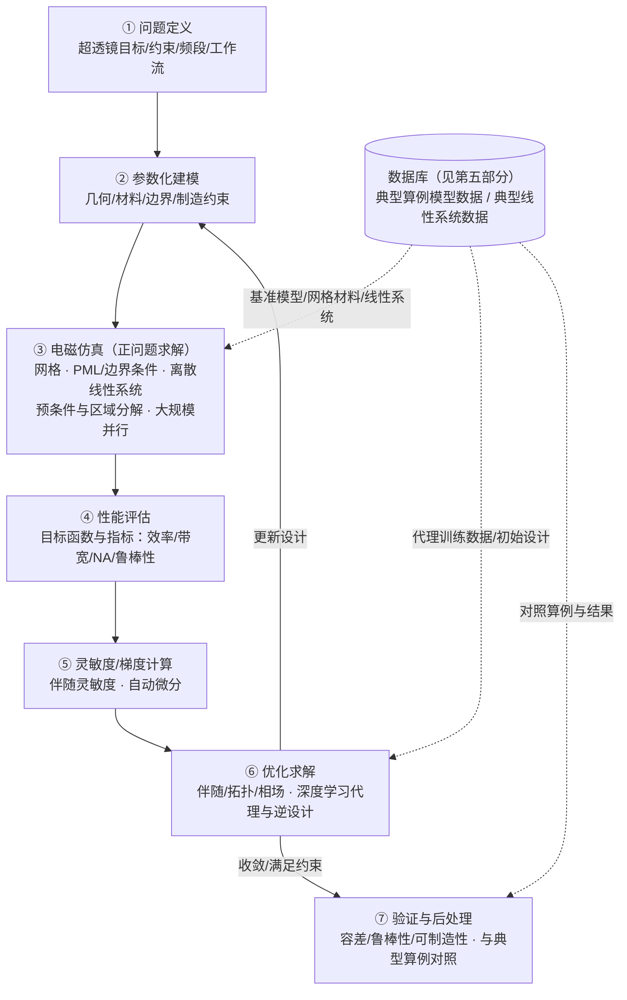
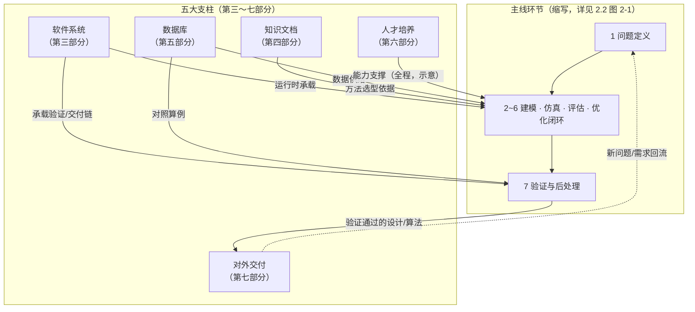
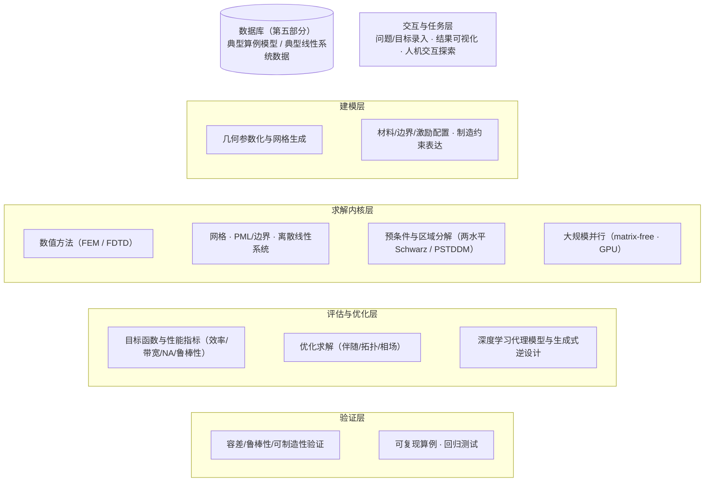
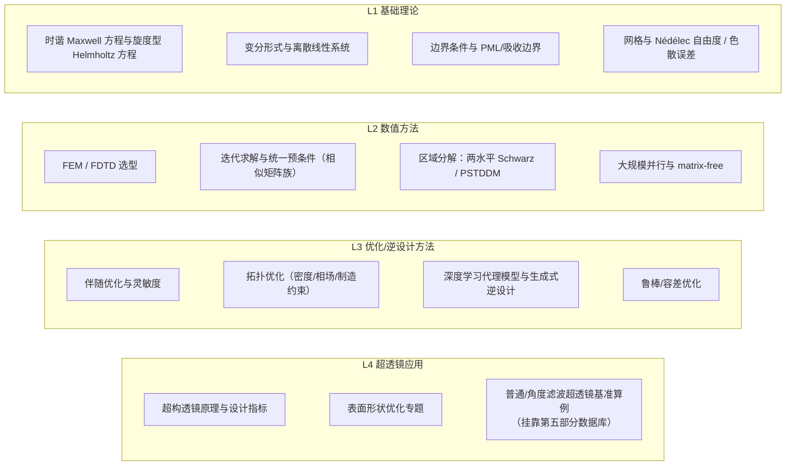

# 《超构透镜表面优化》项目主线文档（初稿 V0.2）

**版本**：初稿 V0.2（待评审）  
**文档定位**：团队计算电磁学长期演化项目的权威概览  

> 导读：本文档回答四类问题——项目整体格局是什么、我的任务在哪、讨论的上下文在哪、下一步如何演化。它不承载数学原理推导，不写学术论文式论证，不做电磁学科普，也不是带时间表的项目计划书。

---

## 一、文档使用说明

### 1.1 目的与边界

**目的**

- 让任何成员在 5 分钟内对齐项目全局，找到自己的位置。
- 让老师和组长能从全局视角推进项目、分配学习任务。
- 让本文档随项目长期演化，始终保持"地图"性质而非"仓库"性质。

**边界**

- 不展开数学原理推导（公式只以引用方式指向知识点文档）。
- 不写学术论文式论证。
- 不做电磁学知识科普。
- 不是带里程碑、时间节点、资源预算的项目计划书。

### 1.2 一份文档，三层读法

|读者|关注点|建议阅读路径|
|---|---|---|
|小组成员|任务位置、讨论上下文|第二部分（全景图）→ 第九部分（任务地图）→ 第十部分（上下文）|
|组长|全局格局、派任务|第二部分 → 第八部分（咬合关系）→ 第九部分（任务地图）|
|老师|主线方向、演化节奏|第二部分 → 第八部分 → 第十二部分（演化规则）|

### 1.3 版本与维护约定

- 本文档由组长维护，老师审定方向性变更。
- 任何成员可在第十一部分提出修改提案。
- 更新时机与规则见第十二部分。
- 规划中的后续部分（自第八部分起编号，避开已编号的第三～七部分）：第八部分 咬合关系；第九部分 任务地图；第十部分 讨论上下文；第十一部分 修改提案；第十二部分 演化规则。

## 二、项目主线

### 2.1 两个维度

本项目最终体系由两个维度构成，二者分工明确：

| 维度       | 内容                      | 回答的问题  | 在文档中的位置      |
| -------- | ----------------------- | ------ | ------------ |
| 维度一：工作流  | 电磁仿真、优化求解等算法工作流程        | 系统运行方式 | 本部分（2.2 全景图） |
| 维度二：五大支柱 | 软件系统、知识文档、数据库、人才培养、项目交付 | 各组件的支撑 | 第三～第七部分      |

**一条算法工作流主线串起项目，五大支柱支撑这条主线的每一步。**

### 2.2 工作流程全景图

> [!NOTE]
> 主线"怎么转"与"靠什么支撑"由两张互补图表达：图 2-1 给出运行时工作流的完整环节与数据供给关系，图 2-2 给出五大支柱对主线环节的支撑关系。图注约定：实线=流程主链或直接承载；虚线=数据供给、对照或需求回流。

*图 2-1 · 运行工作流全景图* 

> [!NOTE]
> 图注：实线为工作流主链。⑤ 提供从④性能评估到⑥优化求解之间所需的梯度信息，由伴随灵敏度或自动微分计算。虚线为数据库（第五部分）对主线各环节的数据供给：③ 需要基准模型与典型线性系统数据，⑥ 需要代理模型训练数据与初始设计，⑦ 需要对照算例与结果做验证基线。节点内关键词的选型依据见第四部分知识地图，运行时模块承载见第三部分架构图。

*图 2-2 · 支柱 × 工作流环节支撑关系图*

| 支柱 | 主要支撑环节 | 支撑方式（详见部分） |
|---|---|---|
| 软件系统 | ②③④⑤⑥⑦ | 运行时承载与算法固化、接口约定（第三部分 3.1 架构图） |
| 知识文档 | ②③⑤⑥ | 方法选型依据：用什么、为什么选、边界在哪（第四部分 4.1 知识地图） |
| 数据库 | ③⑥⑦ | 基准模型/典型线性系统数据、代理训练数据、对照算例（第五部分） |
| 人才培养 | 全程 | 能力阶梯：入门 → 独立 → 带任务（第六部分 6.1） |
| 对外交付 | ① ← → ⑦ | 验证通过算法外送为交付物；新需求回流至问题定义（第七部分 7.3） |

## 三、电磁仿真与优化软件系统

### 3.1 软件系统架构

本系统按"分层模块 + 贯穿组件"组织，各层承接 2.2 图 2-1 的②—⑦环节（建模层承接②，求解内核层承接③，评估与优化层承接④⑤⑥，验证层承接⑦）。

### 3.2 能力边界与演化路线

- 当前能算什么、暂时不能算什么、下一步往哪扩（指针式写法，指向具体算例）。

## 四、计算电磁学知识文档体系

### 4.1 知识地图

分层目录：基础理论 → 数值方法 → 优化/逆设计方法 → 超透镜应用。每层"知识点 + 一句用途"逐行见下表（用途列），层间递进依赖与跨层取用关系由 4.2 绑定与各知识点详细文档承载。

| 知识地图节点（层）                         | 用途                    | 详细文档位置（相对本文件）                                                                                                    |
| --------------------------------- | --------------------- | ---------------------------------------------------------------------------------------------------------------- |
| L1 时谐 Maxwell 方程与旋度型 Helmholtz 方程 | 物理问题到频域方程             | [main.md](../../candidates/00-Background/时谐%20Maxwell%20方程与旋度型亥姆霍兹方程/main.md)                                    |
| L1 网格与 Nédélec 自由度                | FEM 网格数据结构与通用接口       | [main.md](../../candidates/00-Background/FEALPy%20网格模块的基本概念、数据结构与通用接口/main.md)                                   |
| L2 区域分解：两水平 Schwarz               | 两水平加性 Schwarz 完整推导与并行 | [main.md](../metalens/methods/two_level_dd/main.md)                                                              |
| L2 区域分解：PSTDDM                    | 层状源转移法，逐层扫描求解         | [main.md](../metalens/methods/PSTDDM/main.md)                                                                    |
| L2 统一预条件（相似矩阵族）                   | 高频系统病态根源与预条件设计        | [preconditioner.md](../../research/domains/numerical-methods/preconditioner.md)                                  |
| L3 拓扑优化                           | 拓扑/相场方法边界与制造约束        | [topology-optimization.md](../../research/domains/optimization/topology-optimization.md)                         |
| L4 表面形状优化专题 / 应用落点                | 自动化设计开放问题体系与模块依赖      | [metalens-surface-shape-optimization.md](../../research/domains/metalens/metalens-surface-shape-optimization.md) |
| L4 方法综述                           | 仿真优化设计方法、挑战与前沿进展      | [超构透镜仿真优化设计：方法、挑战与前沿进展.md](../metalens/review/超构透镜仿真优化设计：方法、挑战与前沿进展.md)                                          |
| L4 超构透镜入门（先导）                     | 超构透镜是什么、为什么值得做        | [main.md](../../candidates/00-Background/超构透镜/main.md)                                                           |
| L2/L3 其余节点                        | 待补充详细文档               | （待建，遵循 4.3 状态标注）                                                                                                 |

### 4.2 知识点与代码/算例绑定

- 每个知识点必须挂靠：对应代码位置、对应算例、对应仿真任务，保证"知识可追溯、可运行"。
- 算例与数据一侧统一挂靠第五部分数据库（典型算例模型数据 / 典型线性系统数据），代码位置与算例记录在数据库中登记，保证绑定可追溯。

### 4.3 知识文档演化规则

- 谁新增、谁审校、如何标注"待补/过时/已验证"状态。

## 五、数据库

> 定位：为面向超构透镜/高频电磁仿真场景的长期数据资产，不属于任何短期项目。它为工作流各环节提供"可追溯、可复现"的数据供给，登记口径与团队周报"数据归档"约定一致。

### 5.1 数据对象与分层

- **典型算例模型数据**：几何/网格/材料/边界/激励及其来源、参数与处理方式。作为 ③ 仿真的基准输入与 ⑦ 验证的对照基线。
- **典型线性系统数据**：离散化得到的系统矩阵族与右端项（如两水平区域分解的局部/粗系统、PSTDDM 各层系统），以及条件数、特征量等派生量。作为预条件/快速求解方法研究与回归的基准数据。
- **第三方数据与参数化可生成数据**：记录来源、生成方式与接口；在线生成数据不要求全量永久保存，但必须可追溯、可复现或可重新生成。

### 5.2 数据组织与登记

- 每条数据登记：来源、参数、处理方式、接口与复现方式，保证"数据可追溯、可复现"。
- 数据缺口即需求：缺少某类典型算例或线性系统数据时，回流为新的仿真/生成任务（接回图 2-1 的 ③ 环节）。

### 5.3 与主线及其他支柱的关系

- **对工作流**：为 ③ 提供基准模型与典型线性系统数据，为 ⑥ 提供代理训练数据与初始设计，为 ⑦ 提供对照算例（见图 2-1 虚线）。
- **对软件系统**：为 3.1 架构图中求解内核层、评估与优化层、验证层提供回归测试与算例对比输入。
- **对知识文档**：承载 4.2"知识点 ↔ 算例"绑定的数据侧，与 4.1 知识地图应用层 L4 节点对应。
- **对人才培养与对外交付**：典型算例与基准数据可作为学习任务与交付验收的客观基线。

## 六、计算数学人才培养

### 6.1 能力画像

- 计算数学/计算电磁学能力阶梯：入门 → 独立 → 带任务。

### 6.2 任务—知识—能力映射表

- 把第三～五部分（软件系统、知识文档、数据库）的任务、知识点与数据对象映射到具体能力项，成员据此定位自己当前所处层级。

### 6.3 学习任务分配机制

- 老师/组长从主线缺口反推"下一个学习任务"；成员领取、验收、反馈。

## 七、对外项目交付

### 7.1 对外项目类型与接口

- 算法实现类、集成类、定制优化类的差异与对接方式。

### 7.2 算法 → 交付物转化流程

- 从主线中验证通过的算法，到可交付/可集成模块的转化步骤与质量门槛。

### 7.3 需求回流机制

- 对外项目暴露的新问题如何回流为新的仿真/优化/知识/培养需求，接回节点①。
