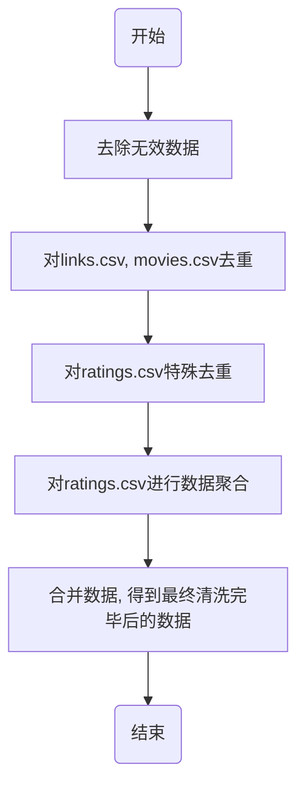

# 1 项目概述
本题关注电影评分数据，通过评分、类型、年代、用户行为等变量分析观众偏好。
使用 MovieLens 数据集：[https://grouplens.org/datasets/movielens/](https://grouplens.org/datasets/movielens/) 
# 2 数据采集与清洗
## 2-1 文件说明
本数据集包含四个文件 `links.csv`、`movies.csv`、`tags.csv`、`ratings.csv`，其中：
- `links.csv` 中有三列：`movieId`、`imdbId`、`tmdbId` 
	- *用途*：该文件中包含了可用于链接到其他电影数据源的标识符
	- `movieId` 为 [https://movielens.org](https://movielens.org) 使用的电影标识符
	- `imdbId` 为 [http://www.imdb.com](http://www.imdb.com) 使用的电影标识符
	- `tmdbId` 为 [https://www.themoviedb.org](https://www.themoviedb.org) 用于标识电影的唯一标识符
- `movies.csv` 中有三列：`movieId`、`title`、`genres` 
	- *用途*：该文件中存储了电影的信息（编号、电影名称、电影类型）
	- `movieId` 同 `links.csv` 中的 `movieId` 
	- `title` 为电影标题，这里的电影标题来自手动输入或从 [https://www.themoviedb.org/](https://www.themoviedb.org/) 导入，并在括号中包含上映年份。这些标题中可能存在错误或不一致之处。
	- `genres` 为电影类型，电影类型以管道分隔，可从以下选项中选择：Action、Adventure、Animation、Children's、Comedy、Crime、Documentary、Drama、Fantasy、Film-Noir、Horror、Musical、Mystery、Romance、Sci-Fi、Thriller、War、Western、(no genres listed)
- `tags.csv` 中有四列：`userId`、`movieId`、`tag`、`timestamp` 
	- *用途*：该文件中除标题行以外的每一行代表一位用户为一部电影添加的一个标签
	- `userId`：用户的唯一标识
	- `movieId`：同 `links.csv` 中的 `movieId` 
	- `tag`：标签，标签是用户生成的关于电影的元数据。每个标签通常是一个单词或短语。特定标签的含义、价值和用途由每个用户自行决定。
	- `timestamp`：时间戳，表示自 1970 年 1 月 1 日午夜协调世界时 (UTC) 起经过的秒数。
- `ratings.csv` 中有四列：`userId`、`movieId`、`rating`、`timestamp` 
	- *用途*：所有评分数据均存储在该文件中。该文件中标题行之后每一行代表一位用户对某部电影的单次评分。该文件中的行首先按 userId 排序，然后在同一用户内按 movieId 排序。
	- `userId`：同 `tags.csv` 中的 `userId` 
	- `movieId`：同 `links.csv` 中的 `movieId` 
	- `rating`：用户评分，评分采用 5 星制，以 0.5 星为增量（0.5 星 - 5.0 星）。
	- `timestamp` 同 `tags.csv` 中的 `ratings.csv` 
## 2-2 实现方案
- 由于数据都是 `csv` 文件，且数据内分隔符为 `,`，故采取函数 `read_csv([path], sep=',')` 读入数据
- 由于分析的问题的性质，只要数据中某行有至少一个 `nan` 数据，就进行删除，故我们采用函数 `dropna(how='any')` 对无效数据进行剔除
- 采用函数 `drop_duplicates()` 对数据进行去重，但注意到 `ratings` 中可能存在一个用户对一个影片进行多次评分，此时应该视为重复，故 `ratings` 中的去重函数应为 `drop_duplicates(subset=['userId', 'movieId'])` 
- 对 `ratings` 数据进行聚合时，应该通过 `movieId` 进行分组（使用 `groupby()` 函数），分组后通过 `mean` 与 `count` 计算分数均值 `avg_rating` 与评分数量 `rating_count`，产生新的 DataFrame 对象 `ratings_agg` 
- 最后将 `links.csv`、`movies_df`、`ratings_agg` 通过函数 `merge()` 进行合并，将合并后的 DataFrame 对象命名为 `data` 
- 得到的 `data.csv` 中共有 7 列，从左到右分别为：
	1. `movieId`：电影 id
	2. `imdbId`：电影 id
	3. `tmdbId`：电影 id
	4. `title`：电影标题
	5. `genres`：电影类型，多个类型用 `|` 分割
	6. `avg_rating`：电影平均评分
	7. `rating_count`：电影评分人数
## 2-3 相关流程图

## 2-4 相关源代码
```python
import numpy as np
import pandas as pd

links_path = "./data/links.csv"
movies_path = "./data/movies.csv"
ratings_path = "./data/ratings.csv"
tags_path = "./data/tags.csv"

links_df = pd.read_csv(links_path, sep=',')
movies_df = pd.read_csv(movies_path, sep=',')
ratings_df = pd.read_csv(ratings_path, sep=',')

# 去除nan数据行
links_df = links_df.dropna(how='any')
movies_df = movies_df.dropna(how='any')
ratings_df = ratings_df.dropna(how='any')

# 去重处理
links_df = links_df.drop_duplicates()  # 去除links中的重复记录
movies_df = movies_df.drop_duplicates()  # 去除movies中的重复记录
# 对于ratings数据，确保每个用户对每部电影只评分一次
ratings_df.drop_duplicates(subset=['userId', 'movieId'])

# ratings数据聚合
ratings_indices_to_drop = ratings_df[ratings_df['timestamp'] > 1262304000].index #从2010年开始计数
ratings_df = ratings_df.drop(ratings_indices_to_drop)
ratings_agg = ratings_df.groupby('movieId').agg({
    'rating': ['mean', 'count'],  # 平均分和评分数量
}).reset_index()
ratings_agg.columns = ['movieId', 'avg_rating', 'rating_count']

data = pd.merge(links_df, movies_df, on='movieId', how='inner')
data = pd.merge(data, ratings_agg, on='movieId', how='inner')
data = data.dropna()
print(data.size)
print(data.head(20))
```
# 3 数据分析与可视化
## 3-1 目标
研究以下问题：
1. 不同电影类型的平均评分、评分人数和评分分布有何差异？
2. 电影上映年代与评分之间是否存在关系？
3. 高分电影和热门电影是否是同一批电影？
## 3-2 问题1
不同电影类型的平均评分、评分人数和评分分布有何差异？
### 3-2-1 每个类型电影评价总量的差异
电影类别总共有 'Action', 'Adventure', 'Animation', 'Comedy', 'Crime', 'Documentary', 'Drama', 'Fantasy', 'Film-Noir', 'Horror', 'Musical', 'Mystery', 'Romance', 'Sci-Fi', 'Thriller', 'War', 'Western' 共 17 类，创建列表 `genres` 存储类别名称，将每一个类别电影的平均评分与评分总人数分别存储到列表 `avg_rating` 与 `rating_count` 中，再通过相关可视化技术得到如下图片
![[1_1.jpg]]
通过上图可以看到 Drama 类型（剧情片）评分人数最多，Documentary 类型（纪录片）评分人数最少，这从侧面反映出人们更爱看剧情片，而看纪录片的人数最少。其中 Comedy（喜剧片）、Action（动作片）、Thriller（惊悚片）也相对受欢迎。
### 3-2-2 每个类型电影平均评分的差异
同样过程可以得到如下图片
![[1_2.jpg]]
通过图片可以看出用户评分整体较低。在此基础上，Horror（恐怖片）评分最低，这说明想要做出很好的恐怖片较为困难；Film-Noir（黑色电影）评分最高，Documentary（纪录片）评分次高
注意到 Film-Noir 与 Documentary 评分人数较少，而评分分数却较高，可以得出结论：大众爱看的电影中想要做出更好的电影较为困难，反而小众电影评分更容易高
### 3-2-3 每个类型电影的评分总数与平均分数之间的关系
为了验证 3-2-2 中的结论，我们将每个电影的评分总数与平均分数作为横纵坐标，绘制二维散点图，可视化两者之间的关系，如下图
![[1_3 1.jpg]]
由于 Drama 与 Comedy 为大众热爱的电影类型，所以评分适中，其他类型可以认为符合“评价人数越少，平均评分越高”的结论
### 3-2-4 评分分布图
我们将每个评分进行数量统计，得到如下评分分布直方图
![[1_4.jpg]]
可以看出评分近似服从偏态分布
## 3-3 问题2
电影上映年代与评分之间是否存在关系？
将所有电影的上映年代作为横坐标，对应平均评分作为纵坐标，得到蓝色散点图。将年代与同一个年代上映的所有电影的平均评分作为纵坐标，得到红色散点图。将红色点列连线得到红色线图，如下图所示：
![[2_1.jpg]]
从图中可见，随着年代的增加，电影平均评分呈现波荡震动，并无明显地提高或减少，故得出结论：电影上映年代与评分基本无关
## 3-4 问题3
高分电影和热门电影是否是同一批电影？
我们可以认为评分数量多的就是热门电影，平均分数高的就是高分电影。热度越高，散点图中的点越黄，反之越紫，得到下图
![[3.jpg]]
由于评论数量过低会导致结论不稳定，故除去特别低分与特别高分的电影外，该图整体呈现出“一个电影越热门，那么这个电影的评分就有可能高”的趋势，故可以认为高分电影和热门电影是同一批电影
# 结果检查
经过多次审核，结果初步认为没有问题。
# 附录 A：代码实现
本项目目录下有 `import_data.py`、`question1.py`、`question2.py`、`question3.py` 四个代码文件，源代码分别如下：
`import_data.py` 源代码
```python
import numpy as np
import pandas as pd

links_path = "./data/links.csv"
movies_path = "./data/movies.csv"
ratings_path = "./data/ratings.csv"
tags_path = "./data/tags.csv"

links_df = pd.read_csv(links_path, sep=',')
movies_df = pd.read_csv(movies_path, sep=',')
ratings_df = pd.read_csv(ratings_path, sep=',')

# 去除nan数据行
links_df = links_df.dropna(how='any')
movies_df = movies_df.dropna(how='any')
ratings_df = ratings_df.dropna(how='any')

# 去重处理
links_df = links_df.drop_duplicates()  # 去除links中的重复记录
movies_df = movies_df.drop_duplicates()  # 去除movies中的重复记录
# 对于ratings数据，确保每个用户对每部电影只评分一次
ratings_df.drop_duplicates(subset=['userId', 'movieId'])

# ratings数据聚合
ratings_indices_to_drop = ratings_df[ratings_df['timestamp'] > 1262304000].index #从2010年开始计数
ratings_df = ratings_df.drop(ratings_indices_to_drop)
ratings_agg = ratings_df.groupby('movieId').agg({
    'rating': ['mean', 'count'],  # 平均分和评分数量
}).reset_index()
ratings_agg.columns = ['movieId', 'avg_rating', 'rating_count']

data = pd.merge(links_df, movies_df, on='movieId', how='inner')
data = pd.merge(data, ratings_agg, on='movieId', how='inner')
data = data.dropna()

data.to_csv('./data/data.csv', index=False)  # index=False 不保存行索引
```

`question1.py` 源代码
```python
import numpy as np
import pandas as pd
import matplotlib.pyplot as plt
plt.rcParams["font.family"] = ["SimHei"]
plt.rcParams["axes.unicode_minus"] = False

data_path = "./data/data.csv"
data = pd.read_csv(data_path, sep=',')

genres = ['Action', 'Adventure', 'Animation', 'Comedy', 'Crime', 'Documentary', 'Drama', 'Fantasy', 'Film-Noir', 'Horror', 'Musical', 'Mystery', 'Romance', 'Sci-Fi', 'Thriller', 'War', 'Western']
avg_rating = []
rating_count = []
for genre in genres:
  is_this_type = data['genres'].str.contains(genre)
  avg_rating.append(data[is_this_type]['avg_rating'].mean())
  rating_count.append(data[is_this_type]['rating_count'].sum())

plt.figure(figsize = (16, 8))
plt.bar(np.arange(len(genres)), rating_count, align='center', color='steelblue', alpha=0.8)
plt.xticks(np.arange(len(genres)), genres)
plt.title('每个类型电影评价总量柱状图')
for x, y in zip(np.arange(len(genres)), rating_count):
  plt.text(x, y, y, ha='center', va='bottom')
plt.savefig(fname='./images/1_1.jpg', dpi=400)

plt.figure(figsize = (16, 8))
plt.bar(np.arange(len(genres)), avg_rating, align='center', color='steelblue', alpha=0.8)
plt.xticks(np.arange(len(genres)), genres)
plt.title('每个类型电影平均评分柱状图')
plt.ylim(2, 4)
for x, y in zip(np.arange(len(genres)), avg_rating):
  plt.text(x, y, round(y, 3), ha='center', va='bottom')
plt.savefig(fname='./images/1_2.jpg', dpi=400)

plt.figure(figsize = (16, 8))
plt.scatter(rating_count, avg_rating)
plt.title('每个类型电影评分总数与平均评分的二维散点图')
plt.xlabel('评分数量')
plt.ylabel('平均评分')
for i, (x, y) in enumerate(zip(rating_count, avg_rating)):
  plt.text(x, y, genres[i], ha='left', va='bottom')
plt.savefig(fname='./images/1_3.jpg', dpi=400)

plt.figure(figsize = (16, 8))
bins = np.linspace(0, 5, 61)
plt.hist(data['avg_rating'], bins=bins, color='lightblue', edgecolor='black', alpha=0.7)
plt.xlabel('评分区间')
plt.ylabel('频数')
plt.title('评分分布直方图')
plt.savefig(fname='./images/1_4.jpg', dpi=400)
```

`question2.py` 源代码
```python
import numpy as np
import pandas as pd
import matplotlib.pyplot as plt
plt.rcParams["font.family"] = ["SimHei"]
plt.rcParams["axes.unicode_minus"] = False

data_path = "./data/data.csv"
data = pd.read_csv(data_path, sep=',')

year = list(map(lambda s: int(s[-5:-1]), data['title']))
avg_rating = list(data['avg_rating'])
df_temp = pd.DataFrame({'year': year, 'avg_rating': avg_rating})
yearly_avg = df_temp.groupby('year')['avg_rating'].mean().sort_index()

plt.figure(figsize=(16, 8))
plt.scatter(year, avg_rating, s=10)
plt.scatter(yearly_avg.index, yearly_avg.values, s=15, alpha=0.5, c='red')
plt.plot(yearly_avg.index, yearly_avg.values, c='red')
plt.title("电影上映时间与电影评分的散点图")
plt.xlabel("电影上映年代")
plt.ylabel("电影平均评分")
plt.savefig(fname='./images/2_1.jpg', dpi=400)
```

`question3.py` 源代码
```python
import numpy as np
import pandas as pd
import matplotlib.pyplot as plt
plt.rcParams["font.family"] = ["SimHei"]
plt.rcParams["axes.unicode_minus"] = False

data_path = "./data/data.csv"
data = pd.read_csv(data_path, sep=',')

sort_by_rating = data.sort_values(by='avg_rating', ascending=False)['title']
sort_by_count = data.sort_values(by='rating_count', ascending=False)['title']
print(sort_by_rating)
print(sort_by_count)

plt.figure(figsize=(10, 8))

# 创建散点图
scatter = plt.scatter(data['avg_rating'], data['rating_count'],
                      c=data['rating_count'], cmap='viridis',
                      s=100, alpha=0.7, linewidth=0.5)
plt.colorbar(scatter, label='评分数量')
plt.xlabel('电影评分', fontsize=12)
plt.ylabel('评分数量', fontsize=12)
plt.title('电影评分 vs 热门程度 分布图', fontsize=14, fontweight='bold')
plt.grid(True, alpha=0.3)
plt.savefig(fname='./images/2_2.jpg', dpi=400)
```
# 附录 B：成员贡献
- 成员 1 (组长)
	- **姓名**：赵默涵
	- **学号**：202405755504
	- **班级**：信息与计算科学 1 班
	- **负责模块**：数据采集与清洗、可视化图片制作、论文结构框架搭建
	- **贡献占比**：33.34%
- 成员 2
	- **姓名**：盛文琼
	- **学号**：202405755529
	- **班级**：信息与计算科学 1 班
	- **负责模块**：问题 2、问题 3、论文编写
	- **贡献占比**：33.33%
- 成员 3
	- **姓名**：郑舒文
	- **学号**：202405755526
	- **班级**：信息与计算科学 1 班
	- **负责模块**：问题 1、结果检查、论文编写
	- **贡献占比**：33.33%